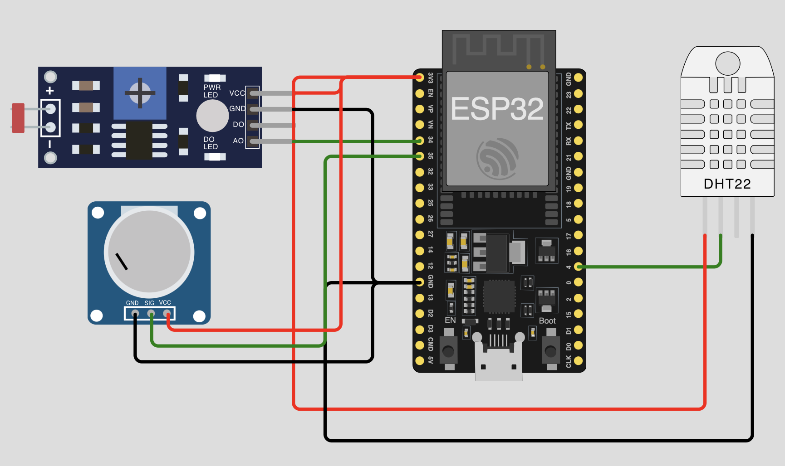

# ใบงานการทดลองที่ 1: Sensor Node

---
## วัตถุประสงค์

- อ่านค่าจากเซ็นเซอร์ DHT11 (อุณหภูมิและความชื้น) และ LDR (แสง) ด้วย ESP32 ได้
- สามารถแสดงผลค่าที่อ่านได้ผ่าน Serial Monitor
- สามารถตั้งค่า ESP32 เป็น Web Server เพื่อแสดงค่าจากเซ็นเซอร์ผ่านเบราว์เซอร์ได้
- สามารถจำลองสถานะ Site และตรวจจับความผิดปกติของสภาพแวดล้อมได้

## อุปกรณ์ที่ใช้ในการทดลอง

| ลำดับ | อุปกรณ์ | จำนวน | ใช้ใน |
| --- | --- | --- | --- |
| 1 | บอร์ด ESP32 | 1 ชุด | 1.1, 1.2, 1.3 |
| 2 | เซ็นเซอร์ DHT11 | 1 ตัว | 1.1, 1.2, 1.3 |
| 3 | LDR (Light Dependent Resistor) | 1 ตัว | 1.1, 1.2, 1.3 |
| 4 | Potentiometer 10kΩ | 1 ตัว | 1.1, 1.2, 1.3 |
| 5 | Resistor 10kΩ | 2 ตัว | 1.1, 1.2, 1.3 |
| 6 | LED สีเขียว | 1 ดวง | 1.3 |
| 7 | LED สีแดง | 1 ดวง | 1.3 |
| 8 | Resistor 220Ω | 2 ตัว | 1.3 |
| 9 | Breadboard และจัมเปอร์ | ตามความเหมาะสม | 1.1, 1.2, 1.3 |
| 10 | สาย USB Micro | 1 เส้น | 1.1, 1.2, 1.3 |

---
# การทดลองที่ 1.1 การอ่านค่าเซ็นเซอร์ผ่าน Serial Monitor

ในส่วนนี้ นักศึกษาจะต่อวงจรเซ็นเซอร์พื้นฐานและอ่านค่าผ่าน Serial Monitor เท่านั้น

## ขั้นตอนการทดลอง

1. ศึกษาวงจรของ Sensor Node สำหรับสถานีเซ็นเซอร์ ดังภาพ

   

   สถานีเซ็นเซอร์ Site A-01 ประกอบด้วยเซ็นเซอร์วัดสิ่งแวดล้อม 3 ชนิด:
   - **DHT11** — วัดอุณหภูมิ (Temperature) และความชื้น (Humidity)
   - **LDR** — วัดความเข้มแสง (Light Intrusion)
    - **Potentiometer** — ใช้จำลองค่าอื่น ๆ (เช่น แรงดันไฟฟ้าของ Site)

   💡 สามารถทดสอบวงจรออนไลน์ผ่าน Wokwi ก่อนลงมือต่อจริง:
   https://wokwi.com/projects/468271764932574209

2. ต่อวงจรตามตารางการเชื่อมต่อต่อไปนี้

   | ESP32 GPIO | อุปกรณ์ | หมายเหตุ |
   | ---------- | ------- | -------- |
   | 3.3V | VCC (DHT11, LDR) | จ่ายไฟ |
   | GND | GND (DHT11, LDR) | กราวด์ร่วม |
   | GPIO 4 | DATA (DHT11) | ใช้ wire pull-up 10kΩ |
   | GPIO 34 | LDR (Analog) | ADC Input |
   | GPIO 35 | Potentiometer | ADC Input |

3. ตรวจสอบการต่อวงจรให้ถูกต้อง ก่อนจ่ายไฟผ่านสาย USB

4. เขียนโปรแกรมอ่านค่าจาก DHT11 และ LDR

   ```cpp
   #include <DHT.h>

   #define DHTPIN 4
   #define DHTTYPE DHT11
   #define LDRPIN 34
   #define POTPIN 35

   DHT dht(DHTPIN, DHTTYPE);

   void setup() {
     Serial.begin(115200);
     dht.begin();
     Serial.println("Sensor Node Ready");
   }

   void loop() {
     float temp = dht.readTemperature();
     float hum = dht.readHumidity();
     int light = analogRead(LDRPIN);
     int pot = analogRead(POTPIN);

     Serial.print("Temp: ");
     Serial.print(temp);
     Serial.print(" C, Hum: ");
     Serial.print(hum);
     Serial.print(" %, Light: ");
     Serial.print(light);
     Serial.print(", Pot: ");
     Serial.println(pot);

     delay(2000);
   }
   ```

5. อัปโหลดโปรแกรมลง ESP32
6. เปิด Serial Monitor (115200 baud) และสังเกตค่าที่อ่านได้
7. ทดลองเป่า DHT11, บัง LDR, หมุน Potentiometer — สังเกตค่าเปลี่ยนแปลง

## บันทึกผลการทดลอง

| เงื่อนไข | Temperature (°C) | Humidity (%) | Light (ADC) | Potentiometer (ADC) |
| -------- | ---------------- | ------------- | ----------- | ------------------- |
| ปกติ | | | | |
| เป่า DHT11 (ร้อนขึ้น) | | | | |
| บัง LDR (มืด) | | | | |
| หมุน Potentiometer | | | | |

### คำถาม

1. ค่า ADC ที่อ่านได้จาก LDR มีช่วงประมาณเท่าใดในสภาพแสงปกติและแสงน้อย
2. ถ้า Potentiometer หมุนจนสุดทาง ค่า ADC ที่ได้เป็นเท่าใด

---
# การทดลองที่ 1.2 การสร้าง Web Server

ต่อจาก 1.1 ตั้งค่า ESP32 เป็น Web Server (AP Mode) เพื่อดูค่าผ่านเบราว์เซอร์โดยไม่ต้องใช้ WiFi Router

## ขั้นตอนการทดลอง

1. เขียนโปรแกรมให้ ESP32 เปิด Access Point และ Web Server

   ```cpp
   #include <DHT.h>
   #include <WiFi.h>
   #include <WebServer.h>

   #define DHTPIN 4
   #define DHTTYPE DHT11
   #define LDRPIN 34
   #define POTPIN 35

   DHT dht(DHTPIN, DHTTYPE);
   WebServer server(80);

   float temp, hum;
   int light, pot;

   void setup() {
     Serial.begin(115200);
     dht.begin();

     WiFi.softAP("Site-A01", "12345678");
     Serial.print("AP IP: ");
     Serial.println(WiFi.softAPIP());

     server.on("/", []() {
       String html = "<!DOCTYPE html><html><head>";
       html += "<meta charset='UTF-8'>";
       html += "<meta http-equiv='refresh' content='2'>";
       html += "<title>Site A-01</title>";
       html += "<style>body{font-family:Arial;text-align:center;margin-top:50px}</style>";
       html += "</head><body>";
       html += "<h1>Site A-01</h1>";
       html += "<p>Temp: " + String(temp) + " C</p>";
       html += "<p>Humidity: " + String(hum) + " %</p>";
       html += "<p>Light: " + String(light) + "</p>";
       html += "<p>Pot: " + String(pot) + "</p>";
       html += "</body></html>";
       server.send(200, "text/html", html);
     });

     server.begin();
   }

   void loop() {
     temp = dht.readTemperature();
     hum = dht.readHumidity();
     light = analogRead(LDRPIN);
     pot = analogRead(POTPIN);

     Serial.print("Temp: ");
     Serial.print(temp);
     Serial.print(" C, Hum: ");
     Serial.print(hum);
     Serial.print(" %, Light: ");
     Serial.print(light);
     Serial.print(", Pot: ");
     Serial.println(pot);

     server.handleClient();
     delay(2000);
   }
   ```

2. อัปโหลดโปรแกรมลง ESP32
3. เปิด Serial Monitor — ดู IP Address ของ AP (เช่น 192.168.4.1)
4. เชื่อมต่อ WiFi ของโทรศัพท์หรือ Notebook เข้ากับ Access Point `Site-A01` (รหัสผ่าน: 12345678)
5. เปิดเบราว์เซอร์ พิมพ์ `http://192.168.4.1` — ควรเห็นหน้าเว็บแสดงค่าจากเซ็นเซอร์
6. สังเกตว่าเมื่อค่ามีการเปลี่ยนแปลง หน้าเว็บจะอัปเดตทุก 2 วินาที

## บันทึกผลการทดลอง

| IP Address ของ AP | SSID | Temp | Humidity | Light |
| ----------------- | ---- | ---- | -------- | ----- |
| | Site-A01 | | | |

### คำถาม

1. ESP32 รับบทบาทเป็น Server หรือ Client ในกรณีนี้
2. นักศึกษาสามารถเข้าถึงหน้าเว็บได้โดยใช้อุปกรณ์ใดบ้าง
3. ถ้าต้องการให้ Web Server แสดงค่าอุณหภูมิเป็น Fahrenheit ควรแก้ไข code ส่วนใด

---
# การทดลองที่ 1.3 การจำลองสถานะ Site

ต่อจาก 1.2 เพิ่ม LED แสดงสถานะและเปลี่ยน ESP32 เชื่อมต่อ WiFi แบบ Station (STA) เพื่อให้ทำงานเหมือน IoT Device จริง

## ขั้นตอนการทดลอง

1. เพิ่ม LED ต่อวงจร

   | ESP32 GPIO | อุปกรณ์ | หมายเหตุ |
   | ---------- | ------- | -------- |
   | GPIO 2 | LED เขียว | Site Normal |
   | GPIO 15 | LED แดง | Site Alarm |

2. ปรับปรุงโปรแกรมจาก 1.2 ให้แสดง STATUS บน Web Page เป็น 3 สถานะ
   - **NORMAL** — ค่าอยู่ในช่วงปกติ
   - **WARNING** — ค่าใกล้เกินขีดจำกัด
   - **ALARM** — ค่าเกินขีดจำกัด

3. กำหนด Threshold

   | ค่า | NORMAL | WARNING | ALARM |
   | --- | ------ | ------- | ----- |
   | Temperature | ≤ 32°C | 33–35°C | > 35°C |
   | Humidity | ≤ 70% | 71–80% | > 80% |
   | Light | 2000–4095 | 1000–1999 | < 1000 |

4. เขียนโปรแกรม — เปลี่ยนจาก AP Mode เป็น STA Mode เพื่อเชื่อมต่อ WiFi Router จริง

   ```cpp
   #include <DHT.h>
   #include <WiFi.h>
   #include <WebServer.h>

   #define DHTPIN 4
   #define DHTTYPE DHT11
   #define LDRPIN 34
   #define POTPIN 35
   #define LED_GREEN 2
   #define LED_RED 15

   const char* ssid = "ชื่อWiFi";
   const char* password = "รหัสผ่าน";

   DHT dht(DHTPIN, DHTTYPE);
   WebServer server(80);

   float temp, hum;
   int light, pot;
   String statusStr;

   String checkStatus() {
     // TODO: เขียน logic ตามตาราง Threshold
     // NORMAL : Temp ≤ 32°C, Hum ≤ 70%, Light 2000–4095
     // WARNING: Temp 33–35°C, Hum 71–80%, Light 1000–1999
     // ALARM  : Temp > 35°C, Hum > 80%, Light < 1000
   }

   void setup() {
     Serial.begin(115200);
     dht.begin();
     pinMode(LED_GREEN, OUTPUT);
     pinMode(LED_RED, OUTPUT);

     Serial.print("Connecting WiFi");
     WiFi.begin(ssid, password);
     while (WiFi.status() != WL_CONNECTED) {
       delay(500);
       Serial.print(".");
     }
     Serial.println();
     Serial.print("Connected, IP: ");
     Serial.println(WiFi.localIP());

     server.on("/", []() {
       String html = "<!DOCTYPE html><html><head>";
       html += "<meta charset='UTF-8'>";
       html += "<meta http-equiv='refresh' content='2'>";
       html += "<title>Site A-01</title>";
       html += "<style>"
               "body{font-family:Arial;text-align:center;margin-top:50px}"
               ".alarm{color:red;font-weight:bold}"
               ".warning{color:orange;font-weight:bold}"
               ".normal{color:green;font-weight:bold}"
               "</style></head><body>";
       html += "<h1>Site A-01</h1>";
       // TODO: เพิ่ม HTML แสดง Status, Temp, Humidity, Light
       // เช่น <p>Status: <span class='normal'>NORMAL</span></p>
       html += "</body></html>";
       server.send(200, "text/html", html);
     });

     server.begin();
   }

   void loop() {
     temp = dht.readTemperature();
     hum = dht.readHumidity();
     light = analogRead(LDRPIN);
     pot = analogRead(POTPIN);

     statusStr = checkStatus();

     if (statusStr == "ALARM") {
       digitalWrite(LED_RED, HIGH);
       digitalWrite(LED_GREEN, LOW);
     } else if (statusStr == "WARNING") {
       digitalWrite(LED_RED, HIGH);
       digitalWrite(LED_GREEN, HIGH);
     } else {
       digitalWrite(LED_RED, LOW);
       digitalWrite(LED_GREEN, HIGH);
     }

     Serial.print("Status: ");
     Serial.print(statusStr);
     Serial.print(", Temp: ");
     Serial.print(temp);
     Serial.print(", Hum: ");
     Serial.print(hum);
     Serial.print(", Light: ");
     Serial.println(light);

     server.handleClient();
     delay(2000);
   }
   ```

5. แก้ไข `const char* ssid` และ `const char* password` ให้ตรงกับ WiFi ที่ใช้งาน
6. อัปโหลดโปรแกรมและทดสอบ
7. เปิด Serial Monitor — รอจนเชื่อมต่อ WiFi สำเร็จ จะเห็น IP Address ที่ได้รับ (DHCP)
8. เปิดเบราว์เซอร์บนเครื่องที่อยู่ WiFi เดียวกัน พิมพ์ IP ที่ได้ — ควรเห็นหน้าเว็บ Site A-01 แสดงสถานะและค่าจากเซ็นเซอร์
9. ทดลองปรับค่าต่าง ๆ เพื่อให้ Sensor Node แสดงแต่ละสถานะ — สังเกต LED และ Status บน Web Page

## บันทึกผลการทดลอง

| สถานะจำลอง | Temperature | Humidity | Light | STATUS | LED เขียว | LED แดง |
| ----------- | ----------- | -------- | ----- | ------ | --------- | ------- |
| ปกติ | 30°C | 60% | 3000 | | | |
| Warning อุณหภูมิ | 34°C | 65% | 2800 | | | |
| Alarm อุณหภูมิ | 38°C | 70% | 2500 | | | |
| Alarm แสงน้อย | 28°C | 55% | 500 | | | |
| Alarm ทั้งหมด | 40°C | 85% | 200 | | | |

### คำถาม

1. การจำแนกระดับ Alarm มีประโยชน์ต่อการดำเนินงานของสถานีเซ็นเซอร์อย่างไร
2. ถ้าต้องการส่งสถานะไปยัง Monitoring Center ควรใช้วิธีการสื่อสารแบบใด (ตอบใน Lab 2)
3. ใน Web Page มีการแบ่งสีของ Status (เขียว/ส้ม/แดง) — สิ่งนี้ช่วยให้ผู้ดูแลระบบเข้าใจสถานะได้อย่างไร

---
# สรุปผลการทดลอง

อธิบายผลการทดลอง พร้อมวิเคราะห์ความถูกต้องของผลลัพธ์ และอธิบายสาเหตุของข้อผิดพลาด (ถ้ามี)

---
# คำถามท้ายใบงาน

1. Sensor Node ในระบบโทรคมนาคมมีหน้าที่อะไรบ้าง จงอธิบาย
2. เหตุใดต้องตรวจสอบทั้งอุณหภูมิ ความชื้น และแสงในสถานีเซ็นเซอร์
3. การใช้ ESP32 เป็น Web Server มีข้อดีและข้อเสียอย่างไรเมื่อเทียบกับการส่งข้อมูลไปยัง Server กลาง
4. ถ้าสถานีเซ็นเซอร์อยู่ในพื้นที่กลางแจ้ง (Outdoor Cabinet) ควรเพิ่มเซ็นเซอร์ใดบ้าง
5. จงเปรียบเทียบการอ่านค่าแบบ Digital (DHT11) กับ Analog (LDR) — ข้อดีข้อเสีย
