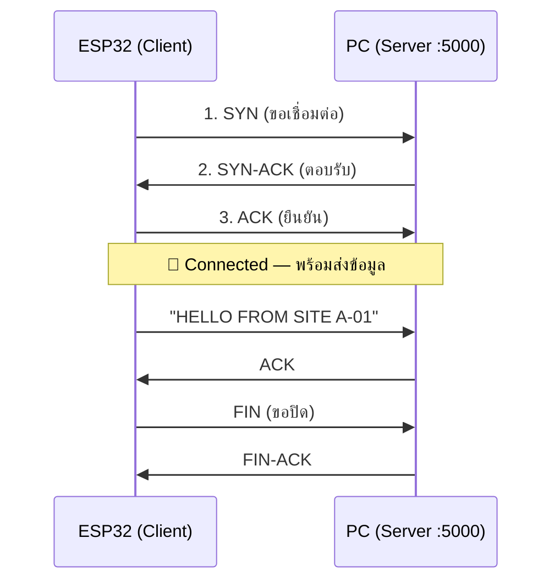
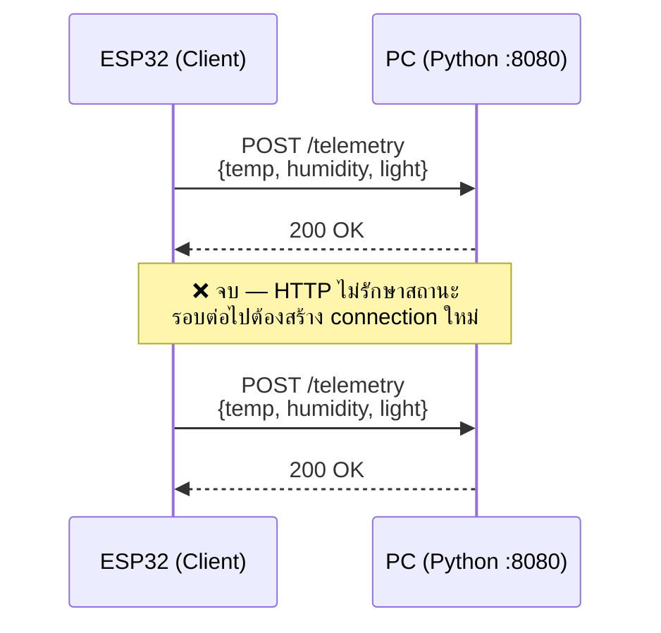
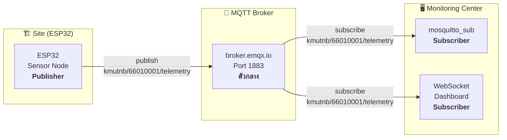

# ใบงานการทดลองที่ 2: Data Communication

---
## วัตถุประสงค์

- อธิบายหลักการส่งข้อมูล Telemetry จาก Sensor Node ไปยัง Monitoring Center ได้
- สามารถเชื่อมต่อ ESP32 กับ WiFi เพื่อส่งข้อมูลแบบ TCP/IP ได้
- สามารถส่งข้อมูล Sensor ผ่าน HTTP POST จาก ESP32 ไปยัง Monitoring Center ได้
- สามารถใช้โปรโตคอล MQTT สำหรับส่งข้อมูลแบบ Real-time ได้
- สามารถสร้าง Heartbeat Mechanism เพื่อตรวจสอบสถานะ Site ได้

## อุปกรณ์ที่ใช้ในการทดลอง

| ลำดับ | อุปกรณ์ | จำนวน |
| --- | --- | --- |
| 1 | บอร์ด ESP32 (จาก Lab 1) | 1 ชุด |
| 2 | OLED Display I2C 128x64 | 1 ตัว |
| 3 | เซ็นเซอร์ DHT11 | 1 ตัว |
| 4 | LDR | 1 ตัว |
| 5 | คอมพิวเตอร์ที่ติดตั้ง Python 3 | 1 เครื่อง |
| 6 | WiFi Router หรือ Access Point | 1 ตัว |

## Arduino Libraries ที่ต้องติดตั้ง

ติดตั้งผ่าน **Arduino Library Manager** (Sketch → Include Library → Manage Libraries...)  
หรือดาวน์โหลดจาก GitHub แล้วติดตั้งแบบ ZIP (Sketch → Include Library → Add .ZIP Library)

| Library | Author | Version¹ | ใช้ใน | รายละเอียด |
|---|---|---|---|---|
| **ArduinoJson** | Benoit Blanchon | ≥6.0 | 2.2, 2.3, 2.4 | สร้าง/แปลง JSON payload — น้ำหนักเบา เหมาะกับ ESP32 |
| **PubSubClient** | Nick O'Leary | ≥2.8 | 2.3, 2.4 | MQTT client สำหรับ ESP32 — publish/subscribe ผ่าน broker |
| **DHT sensor library** | Adafruit | ≥1.4 | 2.2, 2.3 | อ่านค่า DHT11/DHT22 — อุณหภูมิ + ความชื้น |

¹ Version ขั้นต่ำที่แนะนำ — Library Manager จะเลือกเวอร์ชันล่าสุดให้อัตโนมัติ

> 💡 `WiFi.h` และ `HTTPClient.h` — ติดตั้งมาพร้อม ESP32 board package แล้ว ไม่ต้องลงเพิ่ม

| Library | Author | GitHub / Docs |
|---|---|---|
| ArduinoJson | Benoit Blanchon | [arduinojson.org](https://arduinojson.org) |
| PubSubClient | Nick O'Leary | [github.com/knolleary/pubsubclient](https://github.com/knolleary/pubsubclient) |
| DHT sensor library | Adafruit | [github.com/adafruit/DHT-sensor-library](https://github.com/adafruit/DHT-sensor-library) |

## หลักการ TCP/IP (Transmission Control Protocol)

TCP เป็นโปรโตคอลแบบ **Connection-oriented** — ต้องสร้างการเชื่อมต่อก่อนส่งข้อมูล เรียกว่า **3-Way Handshake** หลังจากนั้นข้อมูลจะถูกส่งแบบรับประกันว่าถึงปลายทางและ**เรียงลำดับถูกต้อง**



> 💡 TCP รับประกันความถูกต้อง — เหมาะกับงานที่**ห้ามข้อมูลหาย** แต่ overhead สูงกว่า UDP  
> ในการทดลองนี้จะใช้ TCP เพื่อทดสอบพื้นฐานการเชื่อมต่อก่อนไป HTTP/MQTT

---

# การทดลองที่ 2.1 การเชื่อมต่อ WiFi และส่งข้อมูลแบบ TCP/IP

## ขั้นตอนการทดลอง

1. เปิด TCP Listener ที่คอมพิวเตอร์ ( Terminal ใหม่) — รอรับข้อมูลจาก ESP32

   ```bash
   # macOS / Linux
   nc -l 5000

   # Windows (PowerShell)
   # ใช้ ncat (ติดตั้งผ่าน nmap) หรือเปิด port ใน Windows Firewall ก่อน
   ```

2. เขียนโปรแกรมเชื่อมต่อ ESP32 เข้ากับ WiFi และส่งข้อมูล TCP

   ```cpp
   #include <WiFi.h>

   const char* ssid = "YOUR_SSID";
   const char* password = "YOUR_PASSWORD";

   WiFiClient client;

   void setup() {
     Serial.begin(115200);
     WiFi.begin(ssid, password);

     while (WiFi.status() != WL_CONNECTED) {
       delay(500);
       Serial.print(".");
     }
     Serial.println("\nConnected: " + WiFi.localIP().toString());
   }

   void loop() {
     // TCP Client test
      if (client.connect("<PC_IP>", 5000)) {
        client.println("HELLO FROM SITE A-01");
        client.stop();
      }
      delay(10000);
    }
    ```

    > `<PC_IP>` คือ IP ของคอมพิวเตอร์ที่รัน `nc -l 5000` — หาได้จาก `ifconfig` (macOS/Linux) หรือ `ipconfig` (Windows)

3. บันทึก IP Address ที่ ESP32 ได้รับ (DHCP)
4. ทดสอบ Ping จากคอมพิวเตอร์ไปยัง ESP32

   ```bash
   ping <ESP32_IP>
   ```

5. สังเกตการเชื่อมต่อ — ตรวจสอบ Latency และ Packet Loss

## บันทึกผลการทดลอง

| ครั้งที่ | IP Address ที่ได้รับ | Latency (ms) | Packet Loss |
| ------- | ------------------- | ------------- | ----------- |
| 1 | | | |
| 2 | | | |
| 3 | | | |

---
## หลักการ HTTP (Hypertext Transfer Protocol)

HTTP เป็นโปรโตคอลแบบ **Request/Response** — Client ส่ง Request → Server ตอบ Response → จบ ไม่มีการคงสถานะ (Stateless) ทุก Request คือ connection ใหม่



> 💡 HTTP Request/Response ทุกรอบมี **header overhead** สูง (~200-2,000 bytes) — ไม่เหมาะกับ real-time streaming  
> แต่ใช้งานง่าย — ESP32 แค่ POST JSON ไปหา URL ก็พอ

---

# การทดลองที่ 2.2 การส่งข้อมูลด้วย HTTP POST

## ขั้นตอนการทดลอง

1. รับ Python Receiver บนคอมพิวเตอร์ — เปิด Terminal รันโค้ดต่อไปนี้:

   ```python
   # save เป็น receiver.py แล้วรัน: python3 receiver.py
   from http.server import HTTPServer, BaseHTTPRequestHandler
   import json

   class Handler(BaseHTTPRequestHandler):
       def do_POST(self):
           length = int(self.headers.get('Content-Length', 0))
           body = json.loads(self.rfile.read(length))
           print(f"[{self.client_address[0]}] {json.dumps(body, indent=2)}")
           self.send_response(200)
           self.end_headers()
       def log_message(self, format, *args):
           pass  # ปิด log clutter

   print("📡 HTTP Receiver running on http://0.0.0.0:8080")
   HTTPServer(('0.0.0.0', 8080), Handler).serve_forever()
   ```

   > ⚠️ **Firewall:** ใช้ port 8080 (ไม่ต้อง root) บน WiFi วงเดียวกัน — ปกติไม่มีปัญหา  
   > ถ้า ESP32 กับ PC คนละวง — ข้ามไปใช้ 2.3 (MQTT Public Broker) แทน

2. เขียนโปรแกรม ESP32 ส่ง Sensor Data แบบ HTTP POST ไปยัง PC

   ```cpp
   #include <HTTPClient.h>
   #include <ArduinoJson.h>

   // เปลี่ยน <PC_IP> เป็น IP ของคอมพิวเตอร์ที่รัน receiver.py
   // ดู IP ของ PC ได้จาก: ipconfig (Windows) หรือ ifconfig (macOS/Linux)
   const char* server_url = "http://<PC_IP>:8080/telemetry";

   void sendTelemetryHTTP() {
     WiFiClient client;
     HTTPClient http;
     http.begin(client, server_url);
     http.addHeader("Content-Type", "application/json");

     StaticJsonDocument<200> doc;
     doc["site_id"] = "A-01";
     doc["temperature"] = dht.readTemperature();
     doc["humidity"] = dht.readHumidity();
     doc["light"] = analogRead(LDRPIN);

     String payload;
     serializeJson(doc, payload);

     int httpCode = http.POST(payload);
     Serial.printf("HTTP %d → %s\n", httpCode, payload.c_str());
     http.end();
   }

   void loop() {
     sendTelemetryHTTP();
     delay(5000);  // ส่งทุก 5 วินาที
   }
   ```

3. สังเกตผลลัพธ์ที่ Terminal ของ Python Receiver — ควรเห็น JSON ทุก 5 วินาที

4. เปรียบเทียบ HTTP POST (2.2) กับ MQTT Publish (2.3) — สังเกตความแตกต่าง:
   - HTTP: ESP32 ต้องรู้ IP ของ Receiver → ถ้า IP เปลี่ยน ต้องแก้โค้ด
   - MQTT: ESP32 แค่รู้ Broker → Broker จัดการ routing ให้

## บันทึกผลการทดลอง

| ครั้งที่ | ESP32 → PC IP | HTTP Status | JSON Payload ที่ส่ง |
| ------- | ------------- | ----------- | ----------------- |
| 1 | | | |
| 2 | | | |
| 3 | | | |

```json
// ตัวอย่าง JSON ที่ควรเห็นใน Terminal
{"site_id":"A-01","temperature":30.5,"humidity":65.0,"light":2800}
```

---
## หลักการ MQTT (Message Queuing Telemetry Transport)

MQTT เป็นโปรโตคอลสื่อสารน้ำหนักเบา (Lightweight) ที่ออกแบบมาสำหรับอุปกรณ์ IoT และเครือข่ายที่มีแบนด์วิดท์จำกัด ใช้โมเดล **Publish/Subscribe** ผ่าน Broker ตัวกลาง — อุปกรณ์ไม่ต้องรู้จักกันโดยตรง แค่ต่อหา Broker

### สถาปัตยกรรม MQTT



> 💡 MQTT Broker คือ**ตัวกลาง**รับส่งข้อความ — Publisher กับ Subscriber **ไม่รู้จักกันเลย**  
> รู้แค่ว่ามี Broker อยู่ที่ไหน — Broker จัดการให้ทั้งหมด

### องค์ประกอบหลักของ MQTT

| องค์ประกอบ | คำอธิบาย |
|---|---|
| **Publisher** | ผู้ส่งข้อมูล (ESP32) — publish payload ไปยัง topic |
| **Broker** | ตัวกลางจัดการการเชื่อมต่อ — รับ publish → ส่งต่อให้ subscriber ที่ subscribe topic นั้น |
| **Subscriber** | ผู้รับข้อมูล (Monitoring PC, Dashboard) — subscribe topic ที่สนใจ |
| **Topic** | ชื่อช่องทาง — ใช้ `/` แบ่งลำดับชั้น เช่น `kmutnb/66010001/telemetry` |
| **Client ID** | รหัสเฉพาะของแต่ละอุปกรณ์ที่ต่อ Broker — **ห้ามซ้ำกัน** |

### QoS (Quality of Service) — ระดับความน่าเชื่อถือ

MQTT มี 3 ระดับ QoS — ยิ่งสูงยิ่งมั่นใจว่าข้อมูลถึงปลายทาง แต่ overhead ก็เพิ่มขึ้น

| QoS | ชื่อ | การทำงาน | เหมาะกับ |
|---|---|---|---|
| **0** | At most once | ส่งครั้งเดียว ไม่รอการตอบรับ | Telemetry ทั่วไป (ข้อมูลหลุดบ้างไม่เป็นไร) |
| **1** | At least once | ส่งซ้ำจนกว่าจะได้รับ ACK — อาจได้รับซ้ำได้ | Command, Alert |
| **2** | Exactly once | การันตีว่าได้รับเพียงครั้งเดียว (4-step handshake) | การสั่งการที่ Critical |

> ในการทดลองนี้จะใช้ **QoS 0** เป็นหลัก — เหมาะกับข้อมูลเซ็นเซอร์ที่ส่งทุก 5 วินาที

### MQTT vs HTTP — เมื่อไหร่ควรใช้อะไร

| คุณสมบัติ | MQTT | HTTP |
|---|---|---|
| **โมเดล** | Publish/Subscribe | Request/Response |
| **ทิศทางข้อมูล** | Push (Broker ดันข้อมูลให้) | Pull (Client ต้องร้องขอตลอด) |
| **Header Overhead** | 2 bytes (Fixed header) | ~200–2,000 bytes ต่อ request |
| **Real-time** | ✅ — ต่อเนื่อง, เหมาะกับ streaming | ❌ — ต้อง polling ทุกรอบ |
| **พลังงาน** | ✅ — ต่อ TCP ค้างไว้, keep-alive | ❌ — connect/disconnect ทุก request |
| **ใช้ตอนไหน** | Sensor → NOC รายงานตลอด | REST API, ตั้งค่าครั้งเดียว |

---

# การทดลองที่ 2.3 การส่งข้อมูลด้วย MQTT Telemetry

## ขั้นตอนการทดลอง

1. เลือกใช้ MQTT Broker (เลือกอย่างใดอย่างหนึ่ง)

   **Option A: Public MQTT Broker (แนะนำ — ไม่ต้องติดตั้ง)**
   
   | Broker | Address | Port | Dashboard |
   | --- | --- | --- | --- |
   | EMQX Public | `broker.emqx.io` | 1883 | [broker.emqx.io](http://broker.emqx.io) |
   | HiveMQ Public | `broker.hivemq.com` | 1883 | [hivemq.com/mqtt](http://www.hivemq.com/demos/websocket-client/) |
   | Mosquitto Test | `test.mosquitto.org` | 1883 | — |
   
   > ⚠️ **ข้อควรระวัง:** Public Broker คือพื้นที่สาธารณะ — ข้อมูลที่ส่งไป **ใครก็มองเห็นได้** 
   > ต้องใช้ **Topic Prefix เฉพาะตัว** เช่น `kmutnb/010113330/<รหัสนักศึกษา>/...` เพื่อไม่ให้ชนกับผู้อื่น

   **Option B: ติดตั้ง Mosquitto Broker เอง (ใช้ได้เมื่อไม่มีอินเทอร์เน็ต)**
   
   ```bash
   # macOS
   brew install mosquitto
   mosquitto -d

   # Linux
   sudo apt install mosquitto mosquitto-clients
   sudo systemctl start mosquitto
   ```

2. ติดตั้ง MQTT Library สำหรับ ESP32 (`PubSubClient` โดย Nick O'Leary)
3. เขียนโปรแกรม ESP32 ส่งข้อมูล Sensor ผ่าน MQTT ไปยัง Public Broker

   ```cpp
   #include <PubSubClient.h>

   // ============================================================
   // กำหนดค่าการเชื่อมต่อ — ปรับตามการทดลองของนักศึกษา
   // ============================================================
   const char* mqtt_server = "broker.emqx.io";  // Public Broker
   const int   mqtt_port   = 1883;              // TCP port
   const char* client_id   = "site_66010001";   // เปลี่ยนเป็นรหัสนักศึกษา
   const char* topic_tlm   = "kmutnb/66010001/telemetry";  // Telemetry topic
   const char* topic_cmd   = "kmutnb/66010001/command";    // Command topic
   // ============================================================

   WiFiClient espClient;
   PubSubClient mqtt(espClient);

   void setup() {
     // ... WiFi connection ...
     mqtt.setServer(mqtt_server, mqtt_port);
   }

   void reconnect() {
     while (!mqtt.connected()) {
       if (mqtt.connect(client_id)) {
         mqtt.subscribe(topic_cmd);
       } else {
         delay(5000);
       }
     }
   }

   void loop() {
     if (!mqtt.connected()) reconnect();
     mqtt.loop();

     StaticJsonDocument<200> doc;
     doc["temperature"] = dht.readTemperature();
     doc["humidity"] = dht.readHumidity();
     doc["light"] = analogRead(LDRPIN);

     String payload;
     serializeJson(doc, payload);
     mqtt.publish(topic_tlm, payload.c_str());

     delay(5000);
   }
   ```

4. ทดสอบ Subscribe ข้อมูลด้วย `mosquitto_sub` หรือ MQTT WebSocket Client

   ```bash
   # ใช้ mosquitto_sub (ต้องติดตั้ง mosquitto-clients ก่อน)
   mosquitto_sub -h broker.emqx.io -p 1883 -t "kmutnb/66010001/telemetry"
   ```

   หรือใช้ **EMQX Dashboard** ที่ [broker.emqx.io](http://broker.emqx.io) → WebSocket Client → Subscribe เพื่อดูข้อมูลแบบ GUI

5. ควรเห็น JSON payload ทุก 5 วินาที

## บันทึกผลการทดลอง

| ครั้งที่ | MQTT Broker | Topic (ที่ใช้จริง) | Payload ที่ได้รับ | QoS |
| ------- | ----------- | ----------------- | ---------------- | --- |
| 1 | | | | 0 |
| 2 | | | | 0 |
| 3 | | | | 0 |

---
# การทดลองที่ 2.4 การสร้าง Heartbeat

## ขั้นตอนการทดลอง

1. เพิ่ม Heartbeat Mechanism ในโปรแกรม ESP32 — ใช้ topic prefix เดียวกับ 2.3
   (เพิ่มโค้ดต่อไปนี้ใน sketch เดิม — **ไม่ต้องสร้าง loop() ใหม่**)

   ```cpp
   // ประกาศเพิ่มที่ด้านบนของ sketch (ใกล้กับ topic_tlm, topic_cmd)
   const char* topic_hb = "kmutnb/66010001/heartbeat";
   unsigned long lastHb = 0;

   void sendHeartbeat() {
     StaticJsonDocument<150> doc;
     doc["site_id"] = client_id;
     doc["status"] = "online";
     doc["uptime"] = millis() / 1000;
     doc["rssi"] = WiFi.RSSI();
     doc["free_heap"] = ESP.getFreeHeap();

     String payload;
     serializeJson(doc, payload);
     mqtt.publish(topic_hb, payload.c_str());
   }

   // เพิ่มใน loop() เดิม — ก่อน delay(5000)
   void loop() {
     if (!mqtt.connected()) reconnect();
     mqtt.loop();

     // ... telemetry publish (ของเดิมจาก 2.3) ...

     if (millis() - lastHb >= 30000) {
       sendHeartbeat();
       lastHb = millis();
     }

     delay(5000);
   }
   ```

2. ส่ง Heartbeat ทุก 30 วินาที
3. ตรวจสอบว่าหาก ESP32 หลุดจากการเชื่อมต่อ WiFi จะไม่มีการส่ง Heartbeat

## บันทึกผลการทดลอง

| ช่วงเวลา | Status | Uptime (s) | WiFi RSSI (dBm) | Free Heap |
| --------- | ------ | ---------- | ---------------- | --------- |
| T = 30s | | | | |
| T = 60s | | | | |
| T = 90s | | | | |

---

# สรุปผลการทดลอง

อธิบายผลการทดลอง พร้อมวิเคราะห์ความถูกต้องของผลลัพธ์ และอธิบายสาเหตุของข้อผิดพลาด (ถ้ามี)

---
# คำถามท้ายใบงาน

1. จากประสบการณ์ทดลอง 2.2 (HTTP POST) และ 2.3 (MQTT) — จงเปรียบเทียบข้อดีข้อเสียระหว่าง HTTP และ MQTT สำหรับงาน Telecommunication Monitoring
2. ในระบบจริงที่มีหลาย Site (หลายร้อย Site) ควรออกแบบ MQTT Topic อย่างไร
3. Heartbeat Interval ควรตั้งค่าเท่าใดจึงจะเหมาะสม — พิจารณาทั้ง Network Traffic และความแม่นยำ
4. ถ้า MQTT Broker ล่ม จะมีผลต่อ Sensor Node หรือไม่ — ควรออกแบบระบบให้รองรับสถานการณ์นี้อย่างไร
5. ถ้าต้องการความปลอดภัยของข้อมูลบน Public MQTT Broker ควรเพิ่มกลไกอะไร
