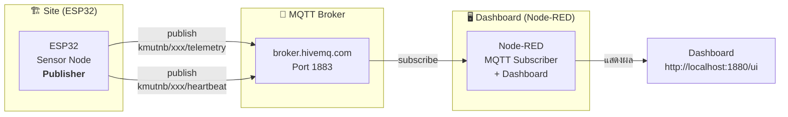
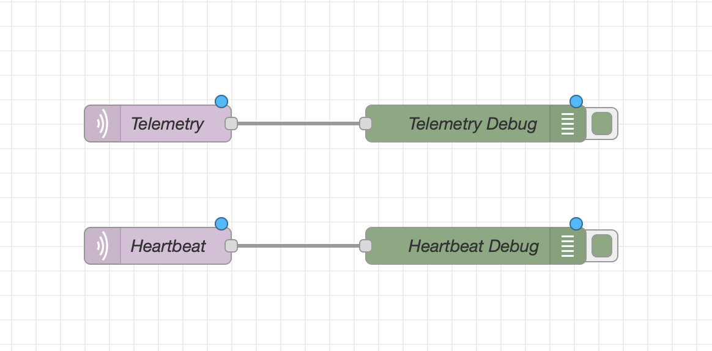
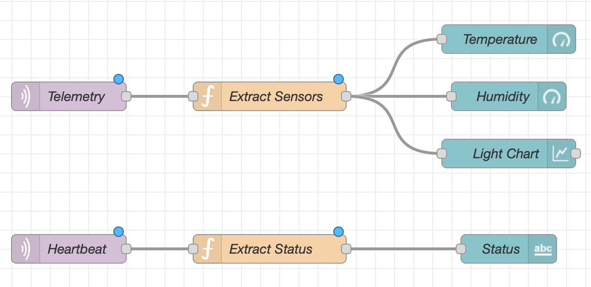

# ใบงานการทดลองที่ 3: IoT Monitoring Dashboard

---
## วัตถุประสงค์

- อธิบายหลักการทำงานของ IoT Monitoring Dashboard สำหรับ monitoring สถานีฐานโทรคมนาคมได้
- สามารถใช้ Node-RED เป็น MQTT Subscriber เพื่อรับข้อมูล Telemetry จาก Sensor Node ได้
- สามารถสร้าง Dashboard แบบ Real-time ด้วย Node-RED Dashboard เพื่อแสดงสถานะของ Site ได้
- สามารถออกแบบ Dashboard Layout ของตัวเองเพื่อแสดงข้อมูล Sensor และสถานะ Online/Offline ได้

## อุปกรณ์ที่ใช้ในการทดลอง

| ลำดับ | อุปกรณ์ | จำนวน |
| --- | --- | --- |
| 1 | ESP32 (จาก Lab 1-2) | 1 ชุด |
| 2 | คอมพิวเตอร์ที่ติดตั้ง Node.js และ Node-RED | 1 เครื่อง |
| 3 | MQTT Broker (Public: `broker.hivemq.com` หรือ Local: Mosquitto) | 1 ตัว |
| 4 | เว็บเบราว์เซอร์ (Chrome, Firefox, Edge) | 1 ตัว |

## ซอฟต์แวร์ที่ต้องติดตั้ง

| ซอฟต์แวร์ | วิธีติดตั้ง | ใช้ใน |
| --- | --- | --- |
| **Node.js** (LTS ≥ 18) | ดาวน์โหลด installer จาก [nodejs.org](https://nodejs.org) — เลือก LTS | 3.1, 3.2, 3.3 |
| **Node-RED** | เปิด Terminal/Command Prompt รัน `npm install -g node-red` | 3.1, 3.2, 3.3 |
| **node-red-dashboard** | ใน Node-RED → Manage palette → Install → ค้น `node-red-dashboard` | 3.2, 3.3 |

> 💡 ติดตั้ง Node.js ก่อน แล้วค่อยติดตั้ง Node-RED ผ่าน `npm` — ไม่ต้อง compile ใด ๆ บน Windows

---

# หลักการ IoT Monitoring Dashboard

IoT Monitoring Dashboard คือศูนย์กลางสำหรับ monitor และแสดงสถานะของอุปกรณ์ IoT ในการทดลองนี้ Dashboard ของเราประกอบด้วย:



> 💡 Node-RED ทำหน้าที่เป็น **MQTT Subscriber** และ **Web Dashboard** ในตัวเดียว — รับข้อมูลจาก Broker แล้วแสดงผลผ่านหน้าเว็บทันที ไม่ต้องเขียนโค้ดเพิ่ม

---

# การทดลองที่ 3.1 การรับข้อมูล MQTT ด้วย Node-RED

ในส่วนนี้ นักศึกษาจะติดตั้ง Node-RED และสร้าง flow ง่าย ๆ เพื่อรับข้อมูลจาก ESP32 ผ่าน MQTT และแสดงผลใน Debug panel — เป็นการทำความเข้าใจ flow การสื่อสารก่อนสร้าง Dashboard

## ขั้นตอนการทดลอง

1. ติดตั้ง Node.js (LTS) จาก [nodejs.org](https://nodejs.org) — ดาวน์โหลด installer สำหรับ Windows แล้วติดตั้งตามปกติ

2. ติดตั้ง Node-RED โดยเปิด Command Prompt หรือ PowerShell รันคำสั่ง:

   ```bash
   npm install -g node-red
   ```

3. รัน Node-RED:

   ```bash
   node-red
   ```

   จะเห็นข้อความแสดงว่า Node-RED รันอยู่ที่ `http://localhost:1880`

4. เปิดเบราว์เซอร์ไปที่ `http://localhost:1880` — จะเห็นหน้าต่าง Node-RED Flow Editor

5. เปิด ESP32 ที่ใช้ใน Lab 2 (ส่ง telemetry และ heartbeat ไปยัง `broker.hivemq.com`) — ตรวจสอบว่า ESP32 กำลัง publish ข้อมูลอยู่

6. สร้าง flow รับข้อมูล MQTT โดยลาก node ต่อไปนี้จากแถบซ้ายไปวางบนกระดาน:

   - ลาก **mqtt in** node วาง 2 ตัว
   ลาก **debug** node วาง 2 ตัว
   - เชื่อม `mqtt in` ตัวแรกเข้ากับ `debug` ตัวแรก
   - เชื่อม `mqtt in` ตัวที่สองเข้ากับ `debug` ตัวที่สอง

7. ตั้งค่า **mqtt in** ตัวที่ 1:

   | ฟิลด์ | ค่า |
   | --- | --- |
   | Server | กดปุ่มดินสอ → Add → Broker: `broker.hivemq.com`, Port: `1883` |
   | Topic | `kmutnb/<รหัสนักศึกษา>/telemetry` |
   | Output | `a JSON Object` |

8. ตั้งค่า **mqtt in** ตัวที่ 2:

   | ฟิลด์ | ค่า |
   | --- | --- |
   | Server | เลือก broker เดียวกับตัวที่ 1 |
   | Topic | `kmutnb/<รหัสนักศึกษา>/heartbeat` |
   | Output | `a JSON Object` |

   > ⚠️ อย่าลืมเปลี่ยน `<รหัสนักศึกษา>` เป็นรหัสนักศึกษาจริงที่ใช้ใน Lab 2

9. กดปุ่ม **Deploy** มุมขวาบน

10. ดูผลที่แถบ **Debug** ทางขวา (กดไอคอนแมลงปีก ถ้าไม่เห็น) — ควรเห็น JSON payload วิ่งเข้ามาทุก 5 วินาที (telemetry) และทุก 30 วินาที (heartbeat)

    

    ตัวอย่าง payload ที่ควรเห็น:

    ```json
    // Telemetry
    {"temperature":30.5,"humidity":65.0,"light":2800}

    // Heartbeat
    {"site_id":"site_66010001","status":"online","uptime":30,"rssi":-55,"free_heap":300000}
    ```

11. ทดสอบปิด ESP32 (ถอดสาย USB) — สังเกตว่าข้อมูลหยุดวิ่งเข้ามาใน Debug panel

## บันทึกผลการทดลอง

| ช่วงเวลา | Topic | Payload ที่ได้รับ |
| --------- | ----- | ---------------- |
| | kmutnb/xxx/telemetry | |
| | kmutnb/xxx/telemetry | |
| | kmutnb/xxx/heartbeat | |

### คำถาม

1. ใน Debug panel ข้อมูล telemetry มากี่วินาทีครั้ง และ heartbeat มากี่วินาทีครั้ง
2. ถ้าเปลี่ยน topic ใน `mqtt in` เป็น `kmutnb/+/telemetry` (ใช้ wildcard `+`) จะเกิดอะไรขึ้น

---

# การทดลองที่ 3.2 การสร้าง Dashboard ด้วย Node-RED Dashboard

ต่อจาก 3.1 ติดตั้ง node-red-dashboard และสร้าง Dashboard แสดงค่า Sensor แบบ Real-time

## ขั้นตอนการทดลอง

1. ติดตั้ง node-red-dashboard:

   - ใน Node-RED กดเมนู `≡` มุมขวาบน → **Manage palette**
   - ไปที่แท็บ **Install** → ค้นหา `node-red-dashboard`
   - กด **Install** → รอจนเสร็จ

2. ลาก node ต่อไปนี้จากแถบซ้าย (หมวด **dashboard**) ไปวางบนกระดาน:

   - **gauge** 2 ตัว (สำหรับ Temperature และ Humidity)
   - **chart** 1 ตัว (สำหรับ Light)
   - **text** 1 ตัว (สำหรับ Status)

    

3. สร้าง Dashboard Tab และ Group:

   - กดปุ่ม **Layout** ทางซ้าย (ใต้แถบ dashboard)
   - สร้าง **Tab** ชื่อ `IoT Monitoring`
   - สร้าง **Group** ชื่อ `Site A-01 Sensors` อยู่ใน Tab นั้น (width: 6)
   - สร้าง **Group** ชื่อ `Site Status` อยู่ใน Tab เดียวกัน (width: 6)

4. ตั้งค่า **gauge** ตัวที่ 1 (Temperature):

   | ฟิลด์ | ค่า |
   | --- | --- |
   | Group | `IoT Monitoring / Site A-01 Sensors` |
   | Label | `Temperature` |
   | Unit | `°C` |
   | Range | 0 – 50 |
   | Segment colors | Green → 32, Yellow → 35, Red |

5. ตั้งค่า **gauge** ตัวที่ 2 (Humidity):

   | ฟิลด์ | ค่า |
   | --- | --- |
   | Group | `IoT Monitoring / Site A-01 Sensors` |
   | Label | `Humidity` |
   | Unit | `%` |
   | Range | 0 – 100 |
   | Segment colors | Green → 70, Yellow → 80, Red |

6. ตั้งค่า **chart** (Light):

   | ฟิลด์ | ค่า |
   | --- | --- |
   | Group | `IoT Monitoring / Site A-01 Sensors` |
   | Label | `Light (ADC)` |
   | Type | Line chart |
   | Y-axis | 0 – 4095 |

7. ตั้งค่า **text** (Status):

   | ฟิลด์ | ค่า |
   | --- | --- |
   | Group | `IoT Monitoring / Site Status` |
   | Label | `Site Status` |
   | Format | `{{msg.payload}}` |

8. เพิ่ม **function** node ระหว่าง `mqtt in` (telemetry) กับ gauge/chart:

   - ลาก **function** node วาง 1 ตัว
   - เชื่อม `mqtt in` (telemetry) → `function` → `gauge temp`, `gauge hum`, `chart light`
   - เขียนโค้ดใน function:

   ```javascript
   msg.payload = {
       temperature: msg.payload.temperature,
       humidity: msg.payload.humidity,
       light: msg.payload.light
   };
   return msg;
   ```

   > 💡 แต่ละ gauge/chart รับค่าเดียวจาก `msg.payload` — ต้องแยกค่าใน function แล้วส่งต่อทีละค่า หรือใช้ **change** node แยก

9. เพิ่ม **function** node ระหว่าง `mqtt in` (heartbeat) กับ text:

   ```javascript
   msg.payload = msg.payload.status;
   return msg;
   ```

10. กด **Deploy**

11. เปิดเบราว์เซอร์ไปที่ `http://localhost:1880/ui` — จะเห็น Dashboard แสดงค่า Sensor แบบ Real-time

12. ทดสอบ:
    - เป่า DHT11 → Temperature gauge ควรขึ้น
    - บัง LDR → Light chart ควรตก
    - ปิด ESP32 → Status ควรยังแสดง `online` (ยังไม่มี timeout detection — จะทำใน 3.3)

### คำถาม

1. Dashboard อัปเดตทุกกี่วินาที และทำไม
2. ถ้าเปิด ESP32 หลายตัว (เปลี่ยน Site ID) Dashboard จะแสดงอย่างไร — จะมีปัญหาอะไรหรือไม่

---

# การทดลองที่ 3.3 การออกแบบ Dashboard ของตัวเอง

ในส่วนนี้ นักศึกษาจะออกแบบ Dashboard Layout ของตัวเอง โดยเลือกข้อมูลที่จะแสดง จัดรูปแบบ และเพิ่มการตรวจจับ Online/Offline Status

## ภาระงาน

นักศึกษาต้องออกแบบ Dashboard ใน Node-RED ให้มีคุณสมบัติดังนี้:

1. **แสดงข้อมูล Sensor อย่างน้อย 2 อย่าง** (เลือกจาก Temperature, Humidity, Light, Potentiometer, RSSI, Uptime, Free Heap — ไม่บังคับแสดงทั้งหมด)

2. **แสดงสถานะ Online/Offline ด้วยสี** — ใช้ `ui_text` หรือ `ui_led` node:
   - 🟢 **Online** — เมื่อได้รับ heartbeat ภายใน 45 วินาที
   - 🔴 **Offline** — เมื่อไม่ได้รับ heartbeat เกิน 45 วินาที

3. **จัด Layout ให้เป็นระเบียบ** — กำหนด Group, Tab, ขนาด widget ให้เหมาะสม

4. **เพิ่ม widget อย่างน้อย 1 อย่างที่ไม่ได้สอนใน 3.2** เช่น:
   - `ui_led` — ไฟแสดงสถานะ
   - `ui_button` — ปุ่มสั่งการ
   - `ui_slider` — ปรับค่า threshold
   - `ui_chart` แบบ bar หรือ gauge แบบ donut

## ขั้นตอนการทดลอง

1. วาง Layout ของ Dashboard บนกระดานก่อน (เขียนหรือวาดในใจ) — ตัดสินใจว่า:
   - จะแสดง Sensor อะไรบ้าง
   - จะจัด Group อย่างไร
   - จะใช้ widget ประเภทใด

2. สร้าง Tab และ Group ใหม่ใน Dashboard Layout (หรือแก้จาก 3.2 ก็ได้)

3. ลาก widget ที่เลือกไปวาง และตั้งค่าให้เชื่อมกับ MQTT input

4. เพิ่มการตรวจจับ Online/Offline:

   - ลาก **function** node สำหรับเก็บเวลา heartbeat ล่าสุด:

   ```javascript
   // เก็บเวลา heartbeat ล่าสุดใน context
   context.set('last_heartbeat', Date.now());
   msg.payload = "online";
   return msg;
   ```

   - ลาก **inject** node ตั้งให้ trigger ทุก 10 วินาที → เชื่อมเข้า **function** ตรวจสอบ timeout:

   ```javascript
   var last = context.get('last_heartbeat') || 0;
   var elapsed = (Date.now() - last) / 1000;

   if (elapsed > 45) {
       msg.payload = "offline";
   } else {
       msg.payload = "online";
   }
   return msg;
   ```

   - เชื่อม output ของ function นี้เข้า `ui_text` หรือ `ui_led` ที่แสดงสถานะ

5. กด **Deploy** และทดสอบ:
   - เปิด ESP32 → สถานะควรเป็น Online (สีเขียว)
   - ปิด ESP32 → รอ 45 วินาที → สถานะควรเปลี่ยนเป็น Offline (สีแดง)

6. แคปเจอร์หน้า Dashboard ของตัวเอง และอธิบายว่า:
   - เลือกแสดง Sensor อะไร เพราะเหตุใด
   - จัด Layout อย่างไร
   - ใช้ widget พิเศษอะไรบ้าง

---
# สรุปผลการทดลอง

อธิบายผลการทดลอง พร้อมวิเคราะห์ความถูกต้องของผลลัพธ์ และอธิบายสาเหตุของข้อผิดพลาด (ถ้ามี)

---
# คำถามท้ายใบงาน

1. IoT Monitoring Dashboard มีบทบาทสำคัญอย่างไร
2. การใช้ Node-RED Dashboard มีข้อดีเมื่อเทียบกับการเขียน Web Application ด้วยตัวเองอย่างไร
3. ถ้าต้องการให้ Dashboard แสดงประวัติ (History) ของข้อมูล ควรเพิ่มอะไรเข้าไปในระบบ
4. จงออกแบบระบบ IoT Monitoring Dashboard สำหรับ 10 Sites โดยระบุโครงสร้าง MQTT Topic และ Dashboard Layout