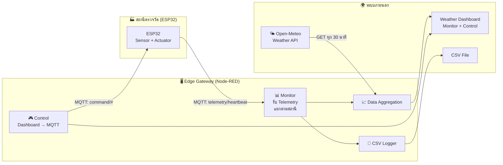

# ใบงานการทดลองที่ 4: Edge Gateway — Weather Station Network

---
## วัตถุประสงค์

- อธิบายแนวคิดของ Edge Gateway — ทั้งการ monitor และควบคุมระยะไกลได้
- สามารถจัดการข้อมูลจากสถานีตรวจวัดอากาศหลายแห่งพร้อมกัน และสั่งการกลับไปยัง ESP32 ผ่าน MQTT ได้
- สามารถทำ Data Logging และ Remote Configuration บน Edge ได้
- สามารถทำ Data Aggregation และสร้าง Weather Dashboard เปรียบเทียบข้อมูล Sensor กับสภาพอากาศจริงจาก Public API ได้

## อุปกรณ์ที่ใช้ในการทดลอง

| ลำดับ | อุปกรณ์ | จำนวน |
| --- | --- | --- |
| 1 | ESP32 (จาก Lab 1-3) | 1-2 ชุด |
| 2 | LED (ใช้ LED_BUILTIN บนบอร์ด ESP32) | มีในตัว |
| 3 | คอมพิวเตอร์ที่ติดตั้ง Node-RED (จาก Lab 3) | 1 เครื่อง |
| 4 | MQTT Broker (`broker.hivemq.com`) | 1 ตัว |
| 5 | เว็บเบราว์เซอร์ | 1 ตัว |

> 💡 ใช้เครื่องมือเดียวกับ Lab 3 — ไม่ต้องซื้ออุปกรณ์ใหม่ และไม่ต้องใช้ Raspberry Pi

---
# หลักการ Edge Gateway — Weather Station Network

ใน Lab นี้เราจะสร้าง **เครือข่ายสถานีตรวจวัดอากาศ** ที่มี ESP32 หลายตัวติดตั้งตามจุดต่าง ๆ ส่งข้อมูลอุณหภูมิ ความชื้น แสง มาที่ Edge Gateway (Node-RED) เพื่อ monitor ภาพรวมและควบคุมระยะไกล พร้อมเทียบกับข้อมูลสภาพอากาศจริงจาก Open-Meteo API

Edge Gateway มีหน้าที่ 2 ทิศทาง:

| ทิศทาง | Protocol | Topic / Endpoint | ข้อมูล |
| --- | --- | --- | --- |
| ⬆️ ESP32 → Gateway | MQTT | `kmutnb/<id>/telemetry` | อุณหภูมิ ความชื้น แสง |
| ⬆️ ESP32 → Gateway | MQTT | `kmutnb/<id>/heartbeat` | สถานะ online, uptime, RSSI |
| ⬇️ Gateway → ESP32 | MQTT | `kmutnb/<id>/command/led` | `ON` / `OFF` |
| ⬇️ Gateway → ESP32 | MQTT | `kmutnb/<id>/command/interval` | ตัวเลขวินาที |
| ⬇️ Gateway → ESP32 | MQTT | `kmutnb/<id>/command/refresh` | `now` |
| ⬇️ External → Gateway | HTTP | `GET api.open-meteo.com/...` | สภาพอากาศจริง |
| ⬆️ Gateway → Storage | File | `telemetry_log.csv` | บันทึกข้อมูล sensor |

---
# การทดลองที่ 4.1 Multi-Station Management + Remote LED Control

สร้าง Dashboard ใน Node-RED ที่รับข้อมูลจาก ESP32 อย่างน้อย 2 ตัว (หรือจำลองด้วย MQTT Client) แยก traffic ตาม station_id แสดงผลแยกแต่ละสถานี และสามารถสั่งเปิด/ปิด LED บน ESP32 ผ่าน Dashboard ได้

## สิ่งที่ต้องทำ

### ฝั่ง ESP32

อัปเดตโค้ดจาก Lab 2 — เพิ่ม MQTT Subscribe ให้ ESP32 รับคำสั่งจาก Gateway ได้:
- Topic: `kmutnb/<รหัสนักศึกษา>/command/#` (ใช้ Wildcard `#` รับทุกคำสั่ง)
- คำสั่งที่ต้องรองรับ: `led` (ON/OFF), `interval` (ตัวเลขวินาที), `refresh` (อ่านค่าและส่งทันที)
- ใช้ `samplingInterval` แทน `delay()` ตายตัว — Gateway เปลี่ยนความถี่ส่งข้อมูลระยะไกลได้
- ทดสอบด้วย `mosquitto_pub` ก่อนเข้า Node-RED

### ฝั่ง Node-RED

| Node ที่ต้องใช้ | หน้าที่ |
|---|---|
| `mqtt in` (2 ตัว) | รับ telemetry และ heartbeat — ใช้ Wildcard `+` รองรับหลาย station_id |
| `function` | ดึง station_id จาก topic, จัดรูปแบบข้อมูล |
| `switch` | แยก traffic ตาม station_id |
| `ui_gauge`, `ui_chart`, `ui_text` | แสดงผล sensor และสถานะ online/offline |
| `ui_switch` | ปุ่มเปิด/ปิด LED |
| `change` | กำหนด station_id ให้แต่ละ control widget |
| `mqtt out` | publish command กลับไป ESP32 |
| `inject` + `function` | ตรวจสอบ heartbeat timeout (45 วิ) แยกตาม station |

### ผลลัพธ์ที่ต้องได้

- Dashboard แสดงข้อมูล real-time จากทุกสถานี — แต่ละสถานีมี Tab ของตัวเอง
- LED บน ESP32 ติด/ดับ ได้จาก Dashboard
- สถานะ Online/Offline เปลี่ยนอัตโนมัติเมื่อ ESP32 หลุดการเชื่อมต่อ

## บันทึกผลการทดลอง

ถ่ายภาพ Dashboard ของแต่ละสถานี (Tab Station A-01 และ Station B-01) — ต้องเห็นค่า Sensor แบบ real-time, สถานะ Online/Offline, และ LED Control Switch พร้อม ESP32 Serial Monitor แสดงการตอบสนองคำสั่ง

---
# การทดลองที่ 4.2 Remote Configuration + Data Logging

เพิ่มความสามารถต่อไปนี้ให้ Edge Gateway:
1. **Remote Configuration** — ปรับ sampling interval และสั่ง refresh ESP32 ผ่าน Dashboard
2. **MQTT → CSV** — บันทึกข้อมูล sensor ลงไฟล์บน Edge

## สิ่งที่ต้องทำ

### Remote Configuration

| Node | หน้าที่ |
|---|---|
| `ui_slider` | ปรับ sampling interval (1-30 วินาที) |
| `ui_button` | สั่ง refresh — อ่าน sensor และส่งทันที |
| `function` | แปลงค่า slider → MQTT topic และ payload |
| `mqtt out` | publish ไป `kmutnb/<id>/command/interval` และ `/command/refresh` |
| `ui_text` | แสดงค่า interval ปัจจุบัน |

### MQTT → CSV Logging

| Node | หน้าที่ |
|---|---|
| `function` | แปลงข้อมูล sensor เป็นแถว CSV (timestamp, station_id, temp, hum, light) |
| `file` | บันทึกแบบ append ลง `telemetry_log.csv` |

### ผลลัพธ์ที่ต้องได้

- เลื่อน Slider → ESP32 เปลี่ยนความถี่ส่งข้อมูล (สังเกตจาก Dashboard หรือ Serial Monitor)
- กด Refresh → ESP32 ส่ง telemetry ทันที
- ไฟล์ `telemetry_log.csv` มีข้อมูล sensor บันทึกเรียงตามเวลา แยกตาม station_id

## บันทึกผลการทดลอง

ถ่ายภาพหน้าจอ:
1. **Dashboard** — Slider Interval, ปุ่ม Refresh, และ Current Interval
2. **Serial Monitor** — แสดง ESP32 ตอบสนองเมื่อเปลี่ยน interval
3. **ไฟล์ `telemetry_log.csv`** — เปิดดูข้อมูลที่บันทึก

---
# การทดลองที่ 4.3 Weather Dashboard + Edge Aggregation + Public API

สร้าง Weather Dashboard หน้าเดียวที่แสดงข้อมูลทุกสถานี พร้อมคำนวณ Aggregate (ค่าเฉลี่ย, min, max) บน Edge และเปรียบเทียบกับสภาพอากาศจริงจาก Open-Meteo API

## สิ่งที่ต้องทำ

### Weather Dashboard

| Node | หน้าที่ |
|---|---|
| `ui_template` | แสดงตาราง HTML — ทุกสถานีในหน้าเดียว: status, temp, hum, light, LED, interval |
| `function` | สร้าง HTML table จากข้อมูลล่าสุดของทุกสถานี (ดึงจาก `flow` context) |
| `inject` | trigger ทุก 5 วินาทีให้ dashboard อัปเดต |

**Layout:** Tab `🌤️ Weather` — Group `Overview` (width 12) — ตารางแสดงข้อมูล real-time พร้อมไฟสถานะ 🟢🔴

### Edge Aggregation

| Node | หน้าที่ |
|---|---|
| `function` (buffer) | เก็บบัฟเฟอร์ 10 ค่าล่าสุดต่อสถานีใน `flow` context |
| `function` (aggregate) | คำนวณค่าเฉลี่ย, min, max ของ temperature, humidity, light |
| `ui_text` | แสดงผล aggregate ใน Tab แต่ละสถานี |
| `ui_chart` | แสดง raw temperature vs aggregate temperature — เทียบความเรียบของเส้นกราฟ |

### Public API Integration — Open-Meteo

| Node | หน้าที่ |
|---|---|
| `inject` | trigger ทุก 30 นาที |
| `http request` | `GET https://api.open-meteo.com/v1/forecast?latitude=13.75&longitude=100.50&current=temperature_2m,relative_humidity_2m` |
| `function` | parse JSON → เก็บใน `flow` context |
| `ui_text` | แสดงสภาพอากาศภายนอกบน Dashboard |

> 💡 Open-Meteo ฟรี ไม่ต้องสมัคร ไม่ต้อง API Key — เปลี่ยน `latitude` `longitude` เป็นพิกัดของตัวเอง

### ผลลัพธ์ที่ต้องได้

- Weather Dashboard แสดงข้อมูลทุกสถานีในตารางเดียว — อัปเดต real-time
- Aggregate แสดง avg/min/max จาก 10 ตัวอย่างล่าสุด
- กราฟเปรียบเทียบ raw vs aggregate — aggregate เรียบกว่า
- สภาพอากาศจาก Open-Meteo ปรากฏบน Dashboard — เทียบค่าอุณหภูมิกับ sensor ได้
- ค่า Δ Temp (sensor − weather) — ถ้าต่างกันมากผิดปกติ → แสดงเป็นสีแดง

## บันทึกผลการทดลอง

ถ่ายภาพ:
1. **Weather Dashboard** (Tab `🌤️ Weather`) — ตารางสรุปทุกสถานี พร้อมสภาพอากาศจาก Open-Meteo และค่า Δ Temp
2. **กราฟเปรียบเทียบ** — raw temperature vs aggregate temperature — ชี้ให้เห็นความต่างของเส้นกราฟ
3. **Tab Station A-01 → Aggregate** — แสดงค่า avg/min/max จาก 10 ตัวอย่างล่าสุด

---
# สรุปผลการทดลอง

อธิบายผลการทดลอง พร้อมวิเคราะห์ความถูกต้องของผลลัพธ์ และอธิบายสาเหตุของข้อผิดพลาด (ถ้ามี)

---
# คำถามท้ายใบงาน

1. Edge Gateway ใน Lab นี้ทำหน้าที่อะไรได้บ้าง — จงอธิบายทั้งมิติ Monitor และ Control พร้อมยกตัวอย่าง MQTT Topic และ HTTP Endpoint
2. การดึงข้อมูลจาก Open-Meteo มาเทียบกับ Sensor — มีประโยชน์อย่างไร และถ้า API ล่มจะส่งผลอะไรกับระบบ
3. ถ้า Edge Gateway หยุดทำงาน — สถานีตรวจวัดอากาศยังทำงานได้หรือไม่ และควรออกแบบระบบสำรองอย่างไร
4. จากประสบการณ์ใน Lab นี้ — จงออกแบบระบบที่ Cloud Server สามารถดึงข้อมูลสภาพอากาศจากทุกสถานีและปรับ sampling interval ของ ESP32 ระยะไกลได้ โดยอธิบาย Protocol Path และ Failure Handling
