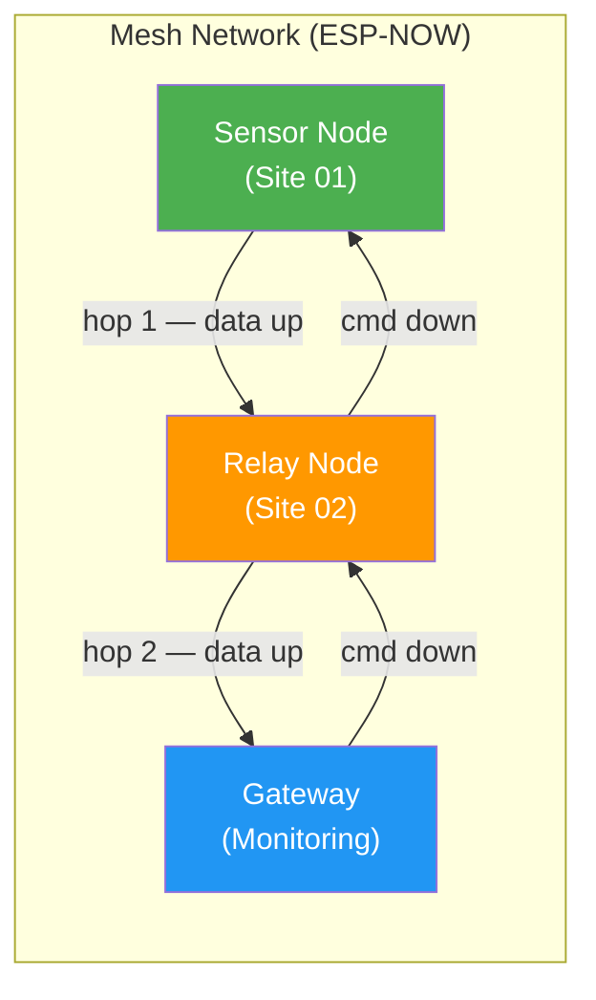
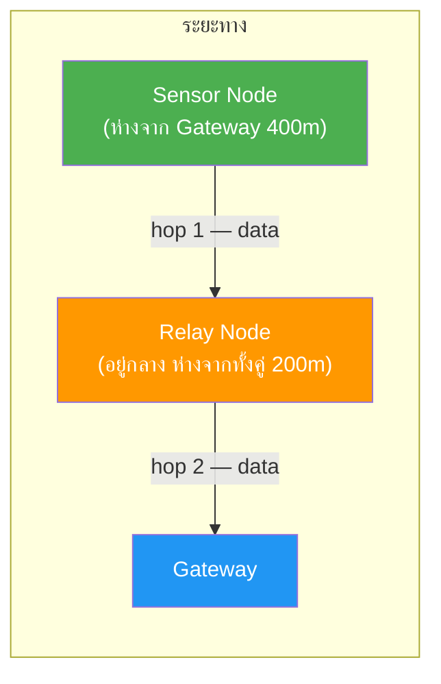
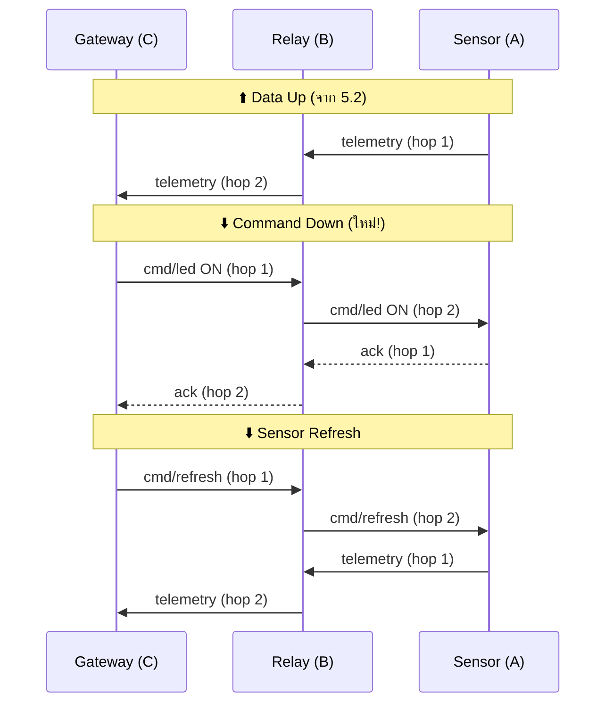

# ใบงานการทดลองที่ 5: Mesh Network ด้วย ESP-NOW

---
## วัตถุประสงค์

- อธิบายหลักการสื่อสาร ESP-NOW ระหว่าง ESP32 หลายตัวโดยไม่ต้องใช้ WiFi Router ได้
- สามารถสร้างการเชื่อมต่อ Peer-to-Peer ระหว่าง ESP32 2 ตัวผ่าน ESP-NOW ได้
- สามารถออกแบบ Mesh Network ที่มี Relay Node ช่วยส่งต่อข้อมูลข้าม hop ได้
- สามารถสั่งการและรับข้อมูลแบบ two-way ผ่าน Mesh Network ได้

## อุปกรณ์ที่ใช้ในการทดลอง

| ลำดับ | อุปกรณ์ | จำนวน |
| --- | --- | --- |
| 1 | บอร์ด ESP32 | 3 ชุด |
| 2 | เซ็นเซอร์ DHT11 | 1 ตัว |
| 3 | LDR | 1 ตัว |
| 4 | OLED Display I2C 128x64 | 1 ตัว |
| 5 | LED สีเขียว | 1 ดวง |
| 6 | LED สีเหลือง | 1 ดวง |
| 7 | LED สีแดง | 1 ดวง |
| 8 | Resistor 220Ω | 3 ตัว |
| 9 | Breadboard และจัมเปอร์ | ตามความเหมาะสม |

> 💡 **ESP-NOW** คือโปรโตคอลสื่อสารระยะสั้นของ Espressif ที่ทำงานแบบ Peer-to-Peer โดยไม่ต้องผ่าน WiFi Router — เหมาะกับระบบเครือข่ายเซ็นเซอร์ที่ต้องการความเร็วและประหยัดพลังงาน

## Arduino Libraries ที่ต้องติดตั้ง

| Library | Author | ใช้ใน | รายละเอียด |
| --- | --- | --- | --- |
| **DHT sensor library** | Adafruit | 5.3 | อ่านค่า DHT11 |
| **Adafruit SSD1306** | Adafruit | 5.3 | ควบคุม OLED Display |
| **Adafruit GFX Library** | Adafruit | 5.3 | Graphics library สำหรับ OLED |

> 💡 `WiFi.h`, `esp_now.h` — ติดตั้งมาพร้อม ESP32 board package แล้ว ไม่ต้องลงเพิ่ม

---

# หลักการ ESP-NOW และ Mesh Network

## ESP-NOW คืออะไร

ESP-NOW เป็นโปรโตคอลสื่อสารไร้สายแบบ **Connectionless** ของ Espressif ที่ออกแบบมาสำหรับการส่งข้อมูลสั้น ๆ ระหว่างอุปกรณ์ ESP32 โดยตรง — ไม่ต้องเชื่อมต่อ WiFi Router, ไม่ต้องมี Internet

| คุณสมบัติ | ESP-NOW | WiFi (STA/AP) |
| --- | --- | --- |
| ต้องมี Router | ❌ ไม่ต้อง | ✅ ต้อง (หรือใช้ AP Mode) |
| ความเร็วในการเชื่อมต่อ | ~1-2 ms | ~1-2 วินาที |
| ขนาด payload สูงสุด | 250 bytes | ได้ไม่จำกัด |
| ระยะทาง | ~200-300 เมตร (ในที่โล่ง) | ขึ้นอยู่กับ AP |
| จำนวน Peer ต่อ ESP32 | สูงสุด 20 | ขึ้นอยู่กับ AP |
| พลังงาน | ต่ำมาก | สูงกว่า |

> 💡 ESP-NOW เหมาะกับการส่งข้อมูลสั้น ๆ เช่น ค่าเซ็นเซอร์, สถานะ, คำสั่ง — ไม่เหมาะกับ streaming หรือข้อมูลขนาดใหญ่

## สถาปัตยกรรม Mesh Network

ในระบบโทรคมนาคมจริง สถานีฐาน (Base Station) หลายแห่งอาจอยู่ห่างกันจนสัญญาณส่งตรงไม่ถึง — **Mesh Network** แก้ปัญหานี้โดยให้แต่ละ Node ช่วย **Relay (ส่งต่อ)** ข้อมูลให้กัน



### แนวคิดหลักของ Mesh

| แนวคิด | คำอธิบาย |
| --- | --- |
| **Node** | ESP32 แต่ละตัวในเครือข่าย — มีบทบาทต่างกัน (Sensor / Relay / Gateway) |
| **Hop** | จำนวนครั้งที่ข้อมูลถูกส่งต่อ — ยิ่งน้อยยิ่งเร็ว |
| **Peer** | คู่สื่อสารที่ ESP32 รู้จัก — ต้อง Register MAC Address ของกันและกัน |
| **Relay** | Node ที่รับข้อมูลจาก Node อื่นแล้วส่งต่อไปยังปลายทาง |
| **Gateway** | Node ปลายทางที่รวมข้อมูลจากทุก Node — เหมือน Monitoring Center |
| **Neighbor Table** | ตารางที่แต่ละ Node เก็บรายชื่อ Peer ที่อยู่ในระยะสื่อสาร |
| **Bidirectional** | ข้อมูลเดินทางได้ 2 ทิศ — Data Up (Sensor→Gateway) และ Command Down (Gateway→Sensor) |

### Message Types

| Type | ค่า | ทิศทาง | คำอธิบาย |
| --- | --- | --- | --- |
| `DATA` | `0x01` | ⬆️ Up | ข้อมูลเซ็นเซอร์จาก Sensor ไป Gateway |
| `ACK` | `0x02` | ⬇️ Down | ยืนยันการได้รับ |
| `RELAY` | `0x03` | ทั้ง 2 ทิศ | ข้อมูลที่ถูกส่งต่อ (forwarded) |
| `CMD` | `0x04` | ⬇️ Down | คำสั่งจาก Gateway ไป Sensor |

---

# การทดลองที่ 5.1 ESP-NOW Peer-to-Peer

ทดลองส่งข้อมูลระหว่าง ESP32 2 ตัวแบบตรง ๆ โดยไม่ต้องผ่าน WiFi Router

## สิ่งที่ต้องทำ

### ขั้นตอนการทดลอง

1. **หา MAC Address** — อัปโหลดโค้ด "Find MAC" ไปยัง ESP32 ทั้ง 2 ตัว เปิด Serial Monitor (115200 baud) จด MAC Address ไว้

2. **ต่อวงจร** — ต่อ LED ที่ GPIO 2 ทั้ง 2 บอร์ด

3. **อัปโหลดโค้ด** — อัปโหลด `sender.ino` ลง ESP32 ตัวที่ 1, `receiver.ino` ลง ESP32 ตัวที่ 2

4. **สังเกตผลลัพธ์** — เปิด Serial Monitor ทั้ง 2 ฝั่ง ดูข้อมูลส่ง/รับ

### โค้ด — Find MAC Address

อัปโหลดโค้ดนี้ไปยัง ESP32 ทั้ง 2 ตัวเพื่อหา MAC Address

```cpp
#include <WiFi.h>

void setup() {
    Serial.begin(115200);
    WiFi.mode(WIFI_STA);
    Serial.print("MAC Address: ");
    Serial.println(WiFi.macAddress());
}

void loop() {}
```

### โค้ด — Sender (ESP32 ตัวที่ 1)

```cpp
#include <esp_now.h>
#include <WiFi.h>

// ============================================================
// เปลี่ยน MAC Address ของ receiver ให้ตรงกับ Serial Monitor
// ============================================================
uint8_t receiverMAC[] = {0xAA, 0xBB, 0xCC, 0xDD, 0xEE, 0xFF};
// ============================================================

#define LED_PIN 2

typedef struct {
    uint8_t  src_mac[6];
    float    temperature;
    float    humidity;
    int      light;
    uint8_t  seq;
} SensorPacket;

SensorPacket myData;
uint8_t seqNum = 0;

void onDataSent(const uint8_t *mac_addr, esp_now_send_status_t status) {
    if (status == ESP_NOW_SEND_SUCCESS) {
        Serial.printf("[OK] Sent seq=%d | T=%.1f H=%.1f L=%d\n",
                      myData.seq, myData.temperature,
                      myData.humidity, myData.light);
        digitalWrite(LED_PIN, HIGH); delay(100); digitalWrite(LED_PIN, LOW);
    } else {
        Serial.printf("[FAIL] Send seq=%d\n", myData.seq);
    }
}

void setup() {
    Serial.begin(115200);
    pinMode(LED_PIN, OUTPUT);
    WiFi.mode(WIFI_STA);

    if (esp_now_init() != ESP_OK) {
        Serial.println("ESP-NOW init failed!");
        return;
    }
    esp_now_register_send_cb(onDataSent);

    esp_now_peer_info_t peerInfo = {};
    memcpy(peerInfo.peer_addr, receiverMAC, 6);
    peerInfo.channel = 0;
    peerInfo.encrypt = false;
    esp_now_add_peer(&peerInfo);

    Serial.println("Sender Ready — MAC: " + WiFi.macAddress());
}

void loop() {
    myData.temperature = 28.0 + random(0, 100) / 10.0;
    myData.humidity    = 60.0 + random(0, 200) / 10.0;
    myData.light       = random(1000, 4000);
    myData.seq         = seqNum++;
    WiFi.macAddress(myData.src_mac);

    esp_now_send(receiverMAC, (uint8_t *)&myData, sizeof(myData));
    delay(2000);
}
```

### โค้ด — Receiver (ESP32 ตัวที่ 2)

```cpp
#include <esp_now.h>
#include <WiFi.h>

#define LED_PIN 2

typedef struct {
    uint8_t  src_mac[6];
    float    temperature;
    float    humidity;
    int      light;
    uint8_t  seq;
} SensorPacket;

SensorPacket incomingData;

void onDataRecv(const uint8_t *mac, const uint8_t *data, int len) {
    memcpy(&incomingData, data, sizeof(incomingData));

    Serial.printf("[RECV] seq=%d | T=%.1f C | H=%.1f%% | L=%d\n",
                  incomingData.seq, incomingData.temperature,
                  incomingData.humidity, incomingData.light);

    digitalWrite(LED_PIN, HIGH); delay(50); digitalWrite(LED_PIN, LOW);
}

void setup() {
    Serial.begin(115200);
    pinMode(LED_PIN, OUTPUT);
    WiFi.mode(WIFI_STA);

    if (esp_now_init() != ESP_OK) {
        Serial.println("ESP-NOW init failed!");
        return;
    }
    esp_now_register_recv_cb(onDataRecv);

    Serial.println("Receiver Ready — MAC: " + WiFi.macAddress());
}

void loop() {
    delay(100);
}
```

> ⚠️ **สำคัญ:** เปลี่ยน `receiverMAC[]` ในโค้ด Sender ให้ตรงกับ MAC Address จริงของ ESP32 ฝั่ง Receiver

### ผลลัพธ์ที่ต้องได้

- ESP32 ทั้ง 2 ตัวค้นพบ MAC Address ของกันและกันได้
- Sender ส่งข้อมูลทุก 2 วินาที — Serial Monitor แสดง "[OK] Sent seq=..."
- Receiver ได้รับข้อมูล — Serial Monitor แสดงค่าจำลอง Temperature, Humidity, Light
- ถ้าถอดสาย USB ของ Receiver ออก — Sender แสดง "[FAIL] Send" ทันที

## บันทึกผลการทดลอง

ถ่ายภาพ Serial Monitor ของทั้ง 2 ฝั่ง — ต้องเห็น Sender ส่งข้อมูล "[OK] Sent" และ Receiver ได้รับ "[RECV] seq=..." พร้อมกัน

### คำถามท้าย 5.1

1. ESP-NOW แตกต่างจาก WiFi STA Mode อย่างไร — ข้อดีข้อเสียสำหรับงาน IoT
2. ทำไม ESP-NOW จึงต้องรู้ MAC Address ของ Peer ก่อนส่งข้อมูล
3. ถ้าต้องการส่งข้อมูลจาก ESP32 ไปยัง Receiver หลายตัวพร้อมกัน ควรทำอย่างไร

---

# การทดลองที่ 5.2 Mesh Relay — ส่งข้อมูลข้าม Hop

เพิ่ม Relay Node ให้ข้อมูลส่งต่อจาก Node ที่อยู่ไกลไปยัง Gateway ได้

## แนวคิด Mesh Relay



> 💡 ในสภาพจริง ESP-NOW ระยะส่งตรงประมาณ 200-300 เมตร — ถ้า Sensor อยู่ห่างจาก Gateway เกินนี้ จะต้องมี Relay Node ช่วยส่งต่อ

## สิ่งที่ต้องทำ

### ขั้นตอนการทดลอง

1. **หา MAC Address** — อัปโหลดโค้ด Find MAC ไปยัง ESP32 ทั้ง 3 ตัว จด MAC ไว้
2. **อัปโหลดโค้ด** — `mesh_node_a.ino` ลง ESP32 #1, `mesh_relay.ino` ลง ESP32 #2, `mesh_gateway.ino` ลง ESP32 #3
3. **ทดสอบ** — เปิด Serial Monitor ทั้ง 3 ฝั่ง ดูข้อมูลเดินทางจาก Node A ผ่าน Relay ไป Gateway

### บทบาทของแต่ละ Node

| Node | ชื่อ | บทบาท |
| --- | --- | --- |
| ESP32 #1 | **Node A** | สร้างข้อมูลจำลอง → ส่งไป Relay |
| ESP32 #2 | **Relay** | รับจาก Node A → ส่งต่อไป Gateway |
| ESP32 #3 | **Gateway** | รับข้อมูลจาก Relay → แสดง Serial Monitor |

### โครงสร้างข้อมูล MeshPacket

```cpp
typedef struct {
    uint8_t  src_mac[6];      // MAC ต้นทาง
    uint8_t  dst_mac[6];      // MAC ปลายทาง
    uint8_t  msg_type;        // 0x01=DATA, 0x03=RELAY
    uint8_t  hop_count;       // จำนวน hop ปัจจุบัน
    uint8_t  max_hop;         // hop สูงสุดที่อนุญาต
    uint32_t packet_id;       // รหัสเฉพาะ (ป้องกันรับซ้ำ)
    float    temperature;
    float    humidity;
    int      light;
    char     origin_site[16]; // ชื่อสถานีต้นทาง
} MeshPacket;
```

### โค้ด — Node A (ESP32 ตัวที่ 1) — ข้อมูลจำลอง

```cpp
#include <esp_now.h>
#include <WiFi.h>

// ============================================================
// เปลี่ยน MAC ของ Relay Node ให้ตรงกับ Serial Monitor
// ============================================================
uint8_t relayMAC[] = {0xAA, 0xBB, 0xCC, 0xDD, 0xEE, 0xFF};
// ============================================================

#define MAX_HOP 3

typedef struct {
    uint8_t  src_mac[6];
    uint8_t  dst_mac[6];
    uint8_t  msg_type;
    uint8_t  hop_count;
    uint8_t  max_hop;
    uint32_t packet_id;
    float    temperature;
    float    humidity;
    int      light;
    char     origin_site[16];
} MeshPacket;

MeshPacket pkt;
uint32_t pktId = 0;

void onDataSent(const uint8_t *mac, esp_now_send_status_t status) {
    Serial.printf("[Node A] %s | #%lu\n",
                  status == ESP_NOW_SEND_SUCCESS ? "OK" : "FAIL", pktId - 1);
}

void setup() {
    Serial.begin(115200);
    WiFi.mode(WIFI_STA);

    esp_now_init();
    esp_now_register_send_cb(onDataSent);

    esp_now_peer_info_t peer = {};
    memcpy(peer.peer_addr, relayMAC, 6);
    peer.channel = 0;
    peer.encrypt = false;
    esp_now_add_peer(&peer);

    Serial.println("Node A Ready — MAC: " + WiFi.macAddress());
}

void loop() {
    float t = 25.0 + random(-50, 50) / 10.0;  // จำลองอุณหภูมิ 20-30°C
    float h = 60.0 + random(-200, 200) / 10.0; // จำลองความชื้น 40-80%
    int   l = random(0, 4095);                   // จำลองค่า ADC LDR

    WiFi.macAddress(pkt.src_mac);
    memcpy(pkt.dst_mac, relayMAC, 6);
    pkt.msg_type  = 0x01; // DATA
    pkt.hop_count = 1;
    pkt.max_hop   = MAX_HOP;
    pkt.packet_id = pktId++;
    pkt.temperature = t;
    pkt.humidity    = h;
    pkt.light       = l;
    strcpy(pkt.origin_site, "Site-01");

    esp_now_send(relayMAC, (uint8_t *)&pkt, sizeof(pkt));
    Serial.printf("[Node A] T=%.1fC H=%.1f%% L=%d\n", t, h, l);

    delay(3000);
}
```

### โค้ด — Relay Node (ESP32 ตัวที่ 2)

```cpp
#include <esp_now.h>
#include <WiFi.h>

// ============================================================
// เปลี่ยน MAC ของ Node A และ Gateway
// ============================================================
uint8_t nodeAMAC[]   = {0x11, 0x22, 0x33, 0x44, 0x55, 0x66};
uint8_t gatewayMAC[] = {0xDD, 0xEE, 0xFF, 0x00, 0x11, 0x22};
// ============================================================

#define LED_PIN 15

typedef struct {
    uint8_t  src_mac[6];
    uint8_t  dst_mac[6];
    uint8_t  msg_type;
    uint8_t  hop_count;
    uint8_t  max_hop;
    uint32_t packet_id;
    float    temperature;
    float    humidity;
    int      light;
    char     origin_site[16];
} MeshPacket;

MeshPacket incoming;

uint32_t seen_ids[100];
int seen_count = 0;

bool isDuplicate(uint32_t id) {
    for (int i = 0; i < seen_count; i++) {
        if (seen_ids[i] == id) return true;
    }
    if (seen_count < 100) seen_ids[seen_count++] = id;
    return false;
}

void addPeer(uint8_t *mac) {
    esp_now_peer_info_t peer = {};
    memcpy(peer.peer_addr, mac, 6);
    peer.channel = 0;
    peer.encrypt = false;
    esp_now_add_peer(&peer);
}

void onDataRecv(const uint8_t *mac, const uint8_t *data, int len) {
    memcpy(&incoming, data, sizeof(incoming));

    // ตรวจสอบ packet ซ้ำ
    if (isDuplicate(incoming.packet_id)) {
        Serial.printf("[Relay] Duplicate #%lu — dropped\n", incoming.packet_id);
        return;
    }

    // ตรวจสอบ hop count
    if (incoming.hop_count >= incoming.max_hop) {
        Serial.println("[Relay] Max hop reached — dropped");
        return;
    }

    Serial.printf("[Relay] RECV #%lu | %s | T=%.1f H=%.1f L=%d | hop=%d/%d\n",
                  incoming.packet_id, incoming.origin_site,
                  incoming.temperature, incoming.humidity, incoming.light,
                  incoming.hop_count, incoming.max_hop);

    // ส่งต่อไป Gateway
    incoming.hop_count++;
    esp_err_t result = esp_now_send(gatewayMAC, (uint8_t *)&incoming, sizeof(incoming));
    Serial.printf("[Relay] → Gateway: %s\n", result == ESP_OK ? "OK" : "FAIL");

    digitalWrite(LED_PIN, HIGH); delay(50); digitalWrite(LED_PIN, LOW);
}

void setup() {
    Serial.begin(115200);
    pinMode(LED_PIN, OUTPUT);
    WiFi.mode(WIFI_STA);

    esp_now_init();
    esp_now_register_recv_cb(onDataRecv);

    addPeer(nodeAMAC);
    addPeer(gatewayMAC);

    Serial.println("Relay Node Ready — MAC: " + WiFi.macAddress());
}

void loop() {
    delay(100);
}
```

### โค้ด — Gateway Node (ESP32 ตัวที่ 3)

```cpp
#include <esp_now.h>
#include <WiFi.h>

#define LED_PIN 13

typedef struct {
    uint8_t  src_mac[6];
    uint8_t  dst_mac[6];
    uint8_t  msg_type;
    uint8_t  hop_count;
    uint8_t  max_hop;
    uint32_t packet_id;
    float    temperature;
    float    humidity;
    int      light;
    char     origin_site[16];
} MeshPacket;

uint32_t totalPackets = 0;

void onDataRecv(const uint8_t *mac, const uint8_t *data, int len) {
    MeshPacket pkt;
    memcpy(&pkt, data, sizeof(pkt));

    totalPackets++;

    Serial.printf("[GW] #%lu | %s | T=%.1f H=%.1f L=%d hop=%d\n",
                  totalPackets, pkt.origin_site,
                  pkt.temperature, pkt.humidity,
                  pkt.light, pkt.hop_count);

    digitalWrite(LED_PIN, HIGH); delay(50); digitalWrite(LED_PIN, LOW);
}

void setup() {
    Serial.begin(115200);
    pinMode(LED_PIN, OUTPUT);
    WiFi.mode(WIFI_STA);

    esp_now_init();
    esp_now_register_recv_cb(onDataRecv);

    Serial.println("Gateway Ready — MAC: " + WiFi.macAddress());
}

void loop() {
    delay(100);
}
```

### ผลลัพธ์ที่ต้องได้

- **Node A** ส่งข้อมูลทุก 3 วินาที — Serial Monitor แสดงค่าจำลอง T/H/L + "[OK]"
- **Relay** ได้รับ → LED เหลืองกะพริบ → ส่งต่อไป Gateway → แสดง "hop=2/3"
- **Gateway** ได้รับ → แสดง packet ที่รับได้พร้อม hop_count
- ถ้าถอด Relay ออก → Node A ส่งไม่ถึง Gateway

## บันทึกผลการทดลอง

ถ่ายภาพ Serial Monitor ของทั้ง 3 Node

### คำถามท้าย 5.2

1. ทำไมต้องมี `max_hop` ใน Mesh Packet — ถ้าไม่มีจะเกิดปัญหาอะไร
2. ถ้า Relay Node หยุดทำงาน Sensor จะยังส่งข้อมูลถึง Gateway ได้หรือไม่ — จะแก้ปัญหานี้อย่างไร
3. ถ้าต้องการให้ Gateway แสดงข้อมูลจาก Sensor หลาย Site ควรออกแบบ Neighbor Table อย่างไร

---

# การทดลองที่ 5.3 Mesh Command — สั่งการย้อนกลับผ่าน Relay

กลับทิศทาง — ให้ **Gateway สั่งการไปยัง Sensor ผ่าน Relay** เช่น สั่งเปิด/ปิด LED, สั่งให้อ่านเซ็นเซอร์แล้วส่งกลับ

## แนวคิด Bidirectional Mesh



> 💡 ในการทดลองนี้ Relay ต้อง forward ข้อมูล **ทั้ง 2 ทิศ** — ไม่ใช่แค่ส่งต่อทางเดียวเหมือน 5.2

## สิ่งที่ต้องทำ

### ขั้นตอนการทดลอง

1. **หา MAC Address** — ใช้ MAC ที่จดไว้จาก 5.1
2. **ต่อวงจร** ตามตารางด้านล่าง
3. **อัปโหลดโค้ดใหม่** — `cmd_sensor.ino`, `cmd_relay.ino`, `cmd_gateway.ino`
4. **ทดสอบ Data Up** — ดูว่า Sensor ยังส่ง telemetry ขึ้นมาได้เหมือน 5.2
5. **ทดสอบ Command Down** — เปิด Serial Monitor ของ Gateway พิมพ์คำสั่ง สังเกต LED บน Sensor
6. **ทดสอบ Sensor Refresh** — สั่งให้ Sensor อ่านค่าแล้วส่งกลับทันที

### การต่อวงจร

| ESP32 GPIO | อุปกรณ์ | หมายเหตุ |
| --- | --- | --- |
| 3.3V | VCC (DHT11, LDR, OLED) | จ่ายไฟ |
| GND | GND (ทุกอุปกรณ์) | กราวด์ร่วม |
| GPIO 4 | DATA (DHT11) | Sensor Node เท่านั้น |
| GPIO 34 | LDR (Analog) | Sensor Node เท่านั้น |
| GPIO 2 | LED เขียว | Sensor — กะพริบเมื่อส่ง/รับ |
| GPIO 15 | LED เหลือง | Relay — กะพริบเมื่อ forward |
| GPIO 13 | LED แดง | Gateway — ติดเมื่อรับข้อมูล |
| GPIO 21 | SDA (OLED) | Gateway เท่านั้น |
| GPIO 22 | SCL (OLED) | Gateway เท่านั้น |

### บทบาทของแต่ละ Node

| Node | ชื่อ | บทบาท |
| --- | --- | --- |
| ESP32 #1 | **Sensor** | ส่ง telemetry + **รับคำสั่ง** → ควบคุม LED |
| ESP32 #2 | **Relay** | forward ข้อมูล **ทั้ง 2 ทิศ** |
| ESP32 #3 | **Gateway** | รับ telemetry + **ส่งคำสั่ง** ผ่าน Serial Monitor |

### โครงสร้างข้อมูล MeshPacket (เพิ่ม cmd_type)

```cpp
typedef struct {
    uint8_t  src_mac[6];
    uint8_t  dst_mac[6];
    uint8_t  msg_type;       // 0x01=DATA, 0x03=RELAY, 0x04=CMD
    uint8_t  cmd_type;       // 0=none, 1=LED ON, 2=LED OFF, 3=REFRESH
    uint8_t  hop_count;
    uint8_t  max_hop;
    uint32_t packet_id;
    float    temperature;
    float    humidity;
    int      light;
    char     origin_site[16];
} MeshPacket;
```

### ข้อกำหนดการออกแบบ (เขียนโค้ดเอง)

นักศึกษาต้องเขียนโค้ดเองโดยอิงจากโค้ด 5.2 โดยเพิ่มฟังก์ชันใหม่ตามบทบาทของแต่ละ Node

**Sensor Node — เพิ่มจาก 5.2:**

- เพิ่ม `onDataRecv` callback — ตรวจสอบ `msg_type == 0x04` (CMD)
- สร้าง `handleCommand()` — ทำตาม cmd_type:
  - `1` = LED ON
  - `2` = LED OFF
  - `3` = REFRESH — อ่าน DHT11 + LDR แล้วส่ง telemetry กลับทันที
- ส่ง ACK กลับไปหา Gateway หลังทำคำสั่งเสร็จ

**Relay Node — เปลี่ยนจาก 5.2:**

- เปลี่ยนจาก forward ทางเดียวเป็น **2 ทิศ**
- เช็ค `dst_mac` ของ packet ที่รับมา — ถ้าเป็นของ Sensor ให้ส่งไป Sensor, ถ้าเป็นของ Gateway ให้ส่งไป Gateway
- ต้องมี peer ทั้ง Sensor และ Gateway

**Gateway Node — เพิ่มจาก 5.2:**

- เพิ่ม `sendCommand()` — สร้าง CMD packet ส่งไป Relay (dst_mac = Sensor)
- อ่านคำสั่งจาก Serial Monitor (`Serial.read()`) — พิมพ์ `1`, `2`, หรือ `3`
- เพิ่ม OLED Display แสดงสถานะ Sensor (ONLINE/OFFLINE), ค่า T/H/L, จำนวน packet

### ผลลัพธ์ที่ต้องได้

**Data Up (เหมือน 5.2):**
- Sensor ส่ง telemetry ทุก 3 วินาที → Relay forward → Gateway รับ + OLED แสดงค่า

**Command Down (ใหม่):**
- พิมพ์ `1` ใน Serial Monitor ของ Gateway → Relay forward → Sensor ได้รับ → **LED สีเขียวบน Sensor ติด**
- พิมพ์ `2` → **LED สีเขียวบน Sensor ดับ**
- พิมพ์ `3` → **Sensor อ่าน DHT11+LDR แล้วส่ง telemetry กลับทันที** (ไม่ต้องรอ 3 วินาที)
- Gateway ได้รับ ACK → Serial Monitor แสดง "[GW] ACK cmd=1 received"

**LED สถานะ:**
- Sensor (GPIO 2 เขียว): กะพริบเมื่อส่ง/รับสำเร็จ
- Relay (GPIO 15 เหลือง): กะพริบทุกครั้งที่ forward
- Gateway (GPIO 13 แดง): ติดเมื่อรับข้อมูล

## บันทึกผลการทดลอง

ถ่ายภาพ Serial Monitor ของทั้ง 3 Node

**สิ่งที่ต้องสังเกต:**

- **Data Up:** Sensor ส่ง telemetry → Relay forward → Gateway รับ + OLED แสดงค่า
- **Command Down:** พิมพ์ `1` ใน Gateway → Relay forward → Sensor ได้รับ → LED สีเขียวบน Sensor ติด → ACK กลับ
- **LED OFF:** พิมพ์ `2` → LED บน Sensor ดับ
- **REFRESH:** พิมพ์ `3` → Sensor อ่าน DHT11+LDR แล้วส่ง telemetry กลับทันที

### คำถามท้าย 5.3

1. ในการทดลอง 5.2 Relay forward ทางเดียว — แต่ 5.3 Relay forward 2 ทิศ อะไรคือสิ่งที่เปลี่ยนไปในโค้ด Relay
2. คำสั่ง `REFRESH` ให้ Sensor ส่ง telemetry กลับทันที — ข้อดีกว่ารอ interval ปกติ 3 วินาทีคืออะไร
3. ในระบบจริง ถ้ามี Sensor หลายตัว Gateway จะสั่งเฉพาะตัวที่ต้องการได้อย่างไร (ไม่ broadcast ทุกตัว)

---

# สรุปผลการทดลอง

อธิบายผลการทดลอง พร้อมวิเคราะห์ความถูกต้องของผลลัพธ์ และอธิบายสาเหตุของข้อผิดพลาด (ถ้ามี)

---

# คำถามท้ายใบงาน

1. ESP-NOW Mesh Network เหมาะกับระบบโทรคมนาคมแบบใด — ยกตัวอย่าง scenario ที่ใช้ได้จริง
2. ถ้าต้องการให้ Sensor Mesh ส่งข้อมูลไปยัง Cloud ผ่าน MQTT — ควรออกแบบ Architecture อย่างไร (จาก Lab 2 และ Lab 4 มาเชื่อม)
