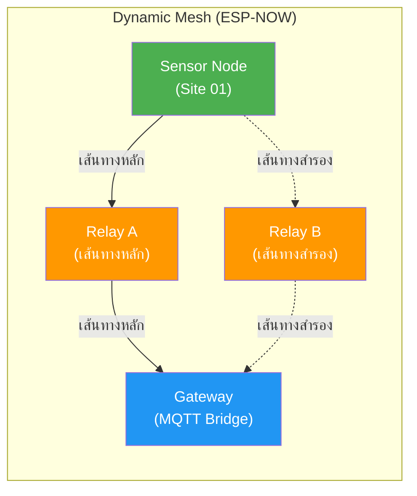
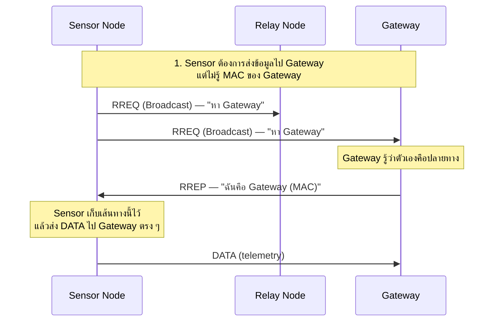
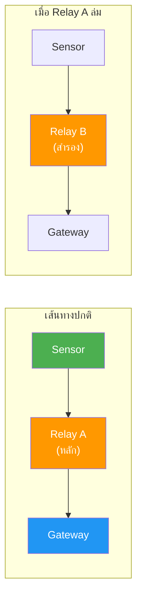
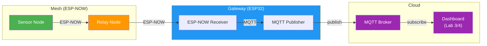

# ใบงานการทดลองที่ 6: Dynamic Mesh Network ด้วย ESP-NOW

---

## วัตถุประสงค์

- อธิบายหลักการ Dynamic Routing ใน Mesh Network ที่เลือกเส้นทางอัตโนมัติได้
- สามารถสร้างระบบค้นหาเส้นทาง (Route Discovery) ไปยัง Gateway โดยไม่ต้องกำหนด MAC Address ตายตัวได้
- สามารถออกแบบ Mesh Network ที่ Self-Healing — เปลี่ยนเส้นทางอัตโนมัติเมื่อ Node ตัวกลางล่มได้
- สามารถเชื่อมต่อ Mesh Network เข้ากับ MQTT เพื่อส่งข้อมูลไปยัง Cloud ได้

## อุปกรณ์ที่ใช้ในการทดลอง

| ลำดับ | อุปกรณ์ | จำนวน |
| --- | --- | --- |
| 1 | บอร์ด ESP32 | 4 ชุด |
| 2 | เซ็นเซอร์ DHT11 | 1 ตัว |
| 3 | LDR | 1 ตัว |
| 4 | LED สีเขียว | 1 ดวง |
| 5 | LED สีเหลือง | 1 ดวง |
| 6 | LED สีแดง | 1 ดวง |
| 7 | Resistor 220Ω | 3 ตัว |
| 8 | Breadboard และจัมเปอร์ | ตามความเหมาะสม |
| 9 | คอมพิวเตอร์ที่ติดตั้ง Python 3 และ MQTT Client | 1 เครื่อง |

> 💡 **Dynamic Mesh** คือเครือข่ายที่ Node แต่ละตัวค้นหาเส้นทางไปยังปลายทางเอง โดยไม่ต้องตั้งค่าเส้นทางตายตัว — เมื่อเส้นทางเดิมล่ม ระบบจะหาเส้นทางใหม่ให้อัตโนมัติ (Self-Healing)

## Arduino Libraries ที่ต้องติดตั้ง

| Library | Author | ใช้ใน | รายละเอียด |
| --- | --- | --- | --- |
| **DHT sensor library** | Adafruit | 6.3 | อ่านค่า DHT11 |
| **PubSubClient** | Nick O'Leary | 6.3 | MQTT client สำหรับ Gateway |

> 💡 `WiFi.h`, `esp_now.h` — ติดตั้งมาพร้อม ESP32 board package แล้ว ไม่ต้องลงเพิ่ม

---

# หลักการ Dynamic Mesh Network

## จาก Static Relay (Lab 5) สู่ Dynamic Routing (Lab 6)

ใน Lab 5 เราใช้ **Static Relay** — Node แต่ละตัวรู้เส้นทางตายตัว (hardcode MAC ของ Relay และ Gateway) ถ้า Relay ตัวกลางล่ม ข้อมูลจะส่งต่อไม่ได้

ใน Lab 6 เราจะเปลี่ยนเป็น **Dynamic Routing** — Node ค้นหาเส้นทางเอง โดยไม่ต้องรู้ MAC ของปลายทางล่วงหน้า

| คุณสมบัติ | Static Relay (Lab 5) | Dynamic Mesh (Lab 6) |
| --- | --- | --- |
| รู้เส้นทางล่วงหน้า | ✅ hardcode MAC | ❌ ค้นหาเอง |
| Relay ล่ม | ❌ ข้อมูลส่งต่อไม่ได้ | ✅ หาเส้นทางใหม่ |
| เพิ่ม Node ใหม่ | ต้องแก้โค้ดทุกตัว | ✅ เข้าร่วมอัตโนมัติ |
| Broadcast | ไม่มี | ✅ ใช้ค้นหาเส้นทาง |
| Neighbor Table | ไม่มี | ✅ เก็บ Node ที่อยู่ใกล้ |

## สถาปัตยกรรม Dynamic Mesh



> 💡 เมื่อ Relay A ล่ม — Sensor Node จะค้นพบว่าเส้นทางหลักใช้ไม่ได้ แล้วสลับไปใช้ Relay B อัตโนมัติ (Self-Healing)

## แนวคิดหลักของ Dynamic Mesh

| แนวคิด | คำอธิบาย |
| --- | --- |
| **Route Discovery** | กระบวนการค้นหาเส้นทางไปยังปลายทาง — ใช้ Broadcast ส่ง Route Request |
| **Route Request (RREQ)** | ข้อความ Broadcast ขอเส้นทางไปยังปลายทาง |
| **Route Reply (RREP)** | ข้อความตอบกลับจากปลายทาง (หรือ Node ที่รู้ทาง) — บอกเส้นทางที่ใช้ได้ |
| **Neighbor Table** | ตารางที่แต่ละ Node เก็บรายชื่อ Node ที่อยู่ในระยะสื่อสาร + ความแรงสัญญาณ (RSSI) |
| **Self-Healing** | ความสามารถของระบบในการกู้เส้นทางใหม่เมื่อเส้นทางเดิมล่ม |
| **Broadcast** | การส่งข้อมูลให้ทุก Node ในระยะรับได้พร้อมกัน — ใช้ค้นหาเส้นทาง |
| **Hop Count** | จำนวนครั้งที่ข้อมูลถูกส่งต่อ — ใช้เลือกเส้นทางที่สั้นที่สุด |

### Message Types

| Type | ค่า | ทิศทาง | คำอธิบาย |
| --- | --- | --- | --- |
| `DATA` | `0x01` | ⬆️ Up | ข้อมูลเซ็นเซอร์จาก Sensor ไป Gateway |
| `RREQ` | `0x02` | 📢 Broadcast | ขอค้นหาเส้นทางไปยังปลายทาง |
| `RREP` | `0x03` | ⬇️ Down | ตอบกลับเส้นทางที่ใช้ได้ |
| `RELAY` | `0x04` | ทั้ง 2 ทิศ | ข้อมูลที่ถูกส่งต่อ (forwarded) |
| `HELLO` | `0x05` | 📢 Broadcast | ประกาศตัวตน — ใช้สร้าง Neighbor Table |

---

# การทดลองที่ 6.1 Dynamic Route Discovery

ค้นหาเส้นทางจาก Sensor Node ไปยัง Gateway โดยอัตโนมัติ — ไม่ต้องกำหนด MAC ของ Relay/ปลายทางตายตัว

## แนวคิด Route Discovery



> 💡 ใน 6.1 เราใช้ topology ง่าย ๆ — Sensor กับ Gateway อยู่ในระยะส่งตรงกัน เพื่อให้เข้าใจหลักการ Route Discovery ก่อน แล้วค่อยเพิ่ม Relay ใน 6.2

## สิ่งที่ต้องทำ

### ขั้นตอนการทดลอง

1. **หา MAC Address** — อัปโหลดโค้ด Find MAC ไปยัง ESP32 ทั้ง 2 ตัว จด MAC ไว้
2. **อัปโหลดโค้ด** — `route_sensor.ino` ลง ESP32 #1, `route_gateway.ino` ลง ESP32 #2
3. **ทดสอบ** — เปิด Serial Monitor ทั้ง 2 ฝั่ง ดู Sensor ค้นหาเส้นทางไป Gateway แล้วส่งข้อมูล

### บทบาทของแต่ละ Node

| Node | ชื่อ | บทบาท |
| --- | --- | --- |
| ESP32 #1 | **Sensor** | ไม่รู้ MAC ของ Gateway → Broadcast RREQ → รับ RREP → ส่ง DATA |
| ESP32 #2 | **Gateway** | รับ RREQ → ตอบ RREP → รับ DATA → แสดง Serial Monitor |

### โครงสร้างข้อมูล MeshPacket

```cpp
typedef struct {
    uint8_t  src_mac[6];      // MAC ต้นทาง
    uint8_t  dst_mac[6];      // MAC ปลายทาง (00:00:00:00:00:00 = broadcast)
    uint8_t  msg_type;        // 0x01=DATA, 0x02=RREQ, 0x03=RREP, 0x04=RELAY
    uint8_t  hop_count;       // จำนวน hop ปัจจุบัน
    uint8_t  max_hop;         // hop สูงสุดที่อนุญาต
    uint32_t packet_id;       // รหัสเฉพาะ (ป้องกันรับซ้ำ)
    float    temperature;
    float    humidity;
    int      light;
    char     origin_site[16]; // ชื่อสถานีต้นทาง
} MeshPacket;
```

### โค้ดต้นแบบ

โค้ดเต็มอยู่ใน `docs/src/lab-6/` — นักศึกษาต้องเขียนโค้ดของตัวเอง โดยอ้างอิงแนวคิดต่อไปนี้

**Sensor Node** (`route_sensor.ino`):

- ไม่รู้ MAC ของ Gateway ล่วงหน้า — ต้อง Broadcast RREQ ก่อน
- เมื่อได้รับ RREP → เก็บ MAC ของ Gateway ไว้ในตัวแปร `gatewayMAC` แล้วส่ง DATA ตรง ๆ

```cpp
// ตัวอย่างแนวคิด — Sensor ส่ง RREQ แบบ Broadcast
uint8_t broadcastMAC[] = {0xFF, 0xFF, 0xFF, 0xFF, 0xFF, 0xFF};
pkt.msg_type = 0x02;                    // RREQ
esp_now_send(broadcastMAC, (uint8_t *)&pkt, sizeof(pkt));

// เมื่อได้รับ RREP (msg_type == 0x03) → เก็บเส้นทาง
memcpy(gatewayMAC, rx.src_mac, 6);
hasRoute = true;
```

**Gateway Node** (`route_gateway.ino`):

- รับ RREQ → ตอบ RREP กลับไปยังต้นทาง (ใช้ `rx.src_mac` เป็นปลายทาง)
- รับ DATA → แสดง Serial Monitor

```cpp
// ตัวอย่างแนวคิด — Gateway ตอบ RREP
if (rx.msg_type == 0x02) {              // RREQ
    rep.msg_type = 0x03;                // RREP
    esp_now_send(rx.src_mac, (uint8_t *)&rep, sizeof(rep));
}
```

### ผลลัพธ์ที่ต้องได้

- **Sensor** ไม่รู้ MAC ของ Gateway ล่วงหน้า — แต่ค้นหาเส้นทางได้เองผ่าน RREQ/RREP
- **Sensor** Broadcast RREQ → **Gateway** ตอบ RREP → **Sensor** เก็บ MAC แล้วส่ง DATA ตรง ๆ
- **Gateway** แสดงข้อมูลที่รับได้พร้อม hop_count
- ถ้าเปิด Serial Monitor ของ Sensor — ต้องเห็น "Route found → Gateway MAC: ..." ก่อน แล้วค่อยเห็น "DATA → Gateway"

## บันทึกผลการทดลอง

ถ่ายภาพ Serial Monitor ของทั้ง 2 Node — ต้องเห็นลำดับ RREQ → RREP → DATA

### คำถามท้าย 6.1

1. ทำไม Sensor Node ต้อง Broadcast RREQ แทนการส่งตรงไปยัง Gateway
2. ถ้าไม่มี RREP ตอบกลับมา Sensor จะทำอย่างไร — และควรแก้ไขโค้ดอย่างไร
3. RREQ ใช้ Broadcast MAC (`FF:FF:FF:FF:FF:FF`) — ข้อดีข้อเสียของการ Broadcast คืออะไร

---

# การทดลองที่ 6.2 Self-Healing Mesh — เปลี่ยนเส้นทางอัตโนมัติ

เพิ่ม Relay Node 2 ตัว — ให้ Sensor ส่งข้อมูลผ่าน Relay ไปยัง Gateway และเมื่อ Relay ตัวหลักล่ม ระบบต้องสลับไปใช้ Relay ตัวสำรองอัตโนมัติ

## แนวคิด Self-Healing



> 💡 **Self-Healing** ทำงานโดย: Sensor ส่ง DATA ผ่าน Relay A → ถ้า Relay A ไม่ตอบ ACK ภายในเวลาที่กำหนด → Sensor สลับไปส่งผ่าน Relay B อัตโนมัติ

## สิ่งที่ต้องทำ

### ขั้นตอนการทดลอง

1. **หา MAC Address** — อัปโหลดโค้ด Find MAC ไปยัง ESP32 ทั้ง 4 ตัว จด MAC ไว้
2. **อัปโหลดโค้ด** — `heal_sensor.ino` ลง ESP32 #1, `heal_relay.ino` ลง ESP32 #2 และ #3, `heal_gateway.ino` ลง ESP32 #4
3. **ทดสอบเส้นทางปกติ** — ดู Sensor ส่งข้อมูลผ่าน Relay A ไป Gateway
4. **ทดสอบ Self-Healing** — ถอดสาย USB ของ Relay A → สังเกต Sensor สลับไปใช้ Relay B อัตโนมัติ

### บทบาทของแต่ละ Node

| Node | ชื่อ | บทบาท |
| --- | --- | --- |
| ESP32 #1 | **Sensor** | ส่ง DATA ผ่าน Relay → ตรวจ ACK → สลับเส้นทางเมื่อ Relay ล่ม |
| ESP32 #2 | **Relay A** | เส้นทางหลัก — forward DATA ไป Gateway + ตอบ ACK |
| ESP32 #3 | **Relay B** | เส้นทางสำรอง — forward DATA ไป Gateway + ตอบ ACK |
| ESP32 #4 | **Gateway** | รับ DATA จาก Relay → แสดง Serial Monitor |

### โครงสร้างข้อมูล MeshPacket (เพิ่ม ACK)

```cpp
typedef struct {
    uint8_t  src_mac[6];
    uint8_t  dst_mac[6];
    uint8_t  msg_type;       // 0x01=DATA, 0x04=RELAY, 0x06=ACK
    uint8_t  hop_count;
    uint8_t  max_hop;
    uint32_t packet_id;
    float    temperature;
    float    humidity;
    int      light;
    char     origin_site[16];
} MeshPacket;
```

### โค้ดต้นแบบ

โค้ดเต็มอยู่ใน `docs/src/lab-6/` — นักศึกษาต้องเขียนโค้ดของตัวเอง โดยอ้างอิงแนวคิดต่อไปนี้

**Sensor Node** (`heal_sensor.ino`):

- รู้ MAC ของ Relay A (หลัก) และ Relay B (สำรอง) — ส่ง DATA ผ่าน Relay ที่ active อยู่
- รอ ACK จาก Relay — ถ้าไม่มาใน `ACK_TIMEOUT` → สลับไปใช้ Relay อีกตัว

```cpp
// ตัวอย่างแนวคิด — สลับเส้นทางเมื่อ Relay ล่ม
void switchRoute() {
    if (activeRelay == relayAMAC) {
        activeRelay = relayBMAC;   // สลับไป Relay B
    } else {
        activeRelay = relayAMAC;   // กลับมา Relay A
    }
    addPeer(activeRelay);
}

// ใน loop() — รอ ACK แล้วสลับถ้าไม่มา
if (!ackReceived) {
    switchRoute();
}
```

**Relay Node** (`heal_relay.ino`):

- รับ DATA → ตอบ ACK กลับไปยัง Sensor (ใช้ `incoming.src_mac`) → forward DATA ไป Gateway
- กัน packet ซ้ำด้วย `packet_id` และจำกัด hop ด้วย `max_hop`

```cpp
// ตัวอย่างแนวคิด — Relay ตอบ ACK แล้ว forward ต่อ
ack.msg_type = 0x06;                              // ACK
esp_now_send(incoming.src_mac, (uint8_t *)&ack, sizeof(ack));

incoming.hop_count++;
esp_now_send(gatewayMAC, (uint8_t *)&incoming, sizeof(incoming));
```

**Gateway Node** (`heal_gateway.ino`):

- รับ DATA จาก Relay → แสดง Serial Monitor (เหมือน 6.1 — ไม่ต้องแก้ logic เพิ่ม)

### ผลลัพธ์ที่ต้องได้

**เส้นทางปกติ:**
- Sensor ส่ง DATA ผ่าน Relay A → Relay A forward ไป Gateway + ตอบ ACK
- Gateway รับข้อมูล — Serial Monitor แสดง packet

**Self-Healing (ถอด Relay A):**
- Sensor ส่ง DATA ผ่าน Relay A → ไม่ได้รับ ACK ภายใน 2 วินาที
- Sensor สลับไปใช้ Relay B อัตโนมัติ → Serial Monitor แสดง "Switched to Relay B"
- Gateway ยังคงรับข้อมูลต่อเนื่องผ่าน Relay B — **ไม่ขาดตอน**

## บันทึกผลการทดลอง

ถ่ายภาพ Serial Monitor ของ Sensor — ต้องเห็นการสลับเส้นทางจาก Relay A → Relay B เมื่อถอด Relay A ออก

### คำถามท้าย 6.2

1. Self-Healing ทำงานอย่างไรในโค้ดนี้ — อะไรเป็นตัวบอกว่าเส้นทางเดิมล่ม
2. ถ้าใช้ ACK Timeout สั้นเกินไป (เช่น 100ms) จะเกิดปัญหาอะไร
3. ในระบบจริงที่มี Relay หลายตัว ควรเลือกเส้นทางที่ดีที่สุดอย่างไร (พิจารณา hop count, RSSI, ความแออัด)

---

# การทดลองที่ 6.3 Mesh → MQTT Gateway — ส่งข้อมูลไป Cloud

เชื่อมต่อ Mesh Network เข้ากับ MQTT — ให้ Gateway รับข้อมูลจาก Sensor ผ่าน ESP-NOW แล้วส่งต่อผ่าน MQTT ไปยัง Cloud (เชื่อม Lab 2/3/4)

## แนวคิด Mesh → MQTT Bridge



> 💡 **Gateway ทำหน้าที่เป็น Bridge (สะพาน)** — รับข้อมูลจาก Mesh (ESP-NOW) แล้วแปลงเป็น MQTT เพื่อส่งไป Cloud — เหมือน Lab 4 ที่ Edge Gateway แปลงโปรโตคอล

## สิ่งที่ต้องทำ

### ขั้นตอนการทดลอง

1. **หา MAC Address** — อัปโหลดโค้ด Find MAC ไปยัง ESP32 ทั้ง 3 ตัว จด MAC ไว้
2. **อัปโหลดโค้ด** — `mesh_sensor.ino` ลง ESP32 #1, `mesh_relay.ino` ลง ESP32 #2, `mqtt_gateway.ino` ลง ESP32 #3
3. **เปิด MQTT Subscriber** — ใช้ `mosquitto_sub` หรือ HiveMQ WebSocket Client subscribe topic
4. **ทดสอบ** — ดูข้อมูลจาก Sensor ผ่าน Mesh ไปยัง MQTT Broker

### บทบาทของแต่ละ Node

| Node | ชื่อ | บทบาท |
| --- | --- | --- |
| ESP32 #1 | **Sensor** | ส่ง DATA ผ่าน ESP-NOW ไป Relay |
| ESP32 #2 | **Relay** | forward DATA ไป Gateway |
| ESP32 #3 | **Gateway** | รับ ESP-NOW → publish MQTT ไป Cloud |

### โค้ดต้นแบบ

โค้ดเต็มอยู่ใน `docs/src/lab-6/` — นักศึกษาต้องเขียนโค้ดของตัวเอง โดยอ้างอิงแนวคิดต่อไปนี้

**Sensor Node** (`mesh_sensor.ino`):

- เหมือน Sensor ใน 6.1/6.2 — ส่ง DATA ผ่าน ESP-NOW ไปยัง Relay (รู้ MAC ของ Relay ล่วงหน้า)
- ใช้ `MeshPacket` struct เดียวกัน — ไม่ต้องแก้ logic ใหม่

**Relay Node** (`mesh_relay.ino`):

- เหมือน Relay ใน 6.2 — รับ DATA → forward ไป Gateway (กันซ้ำ + จำกัด hop)

**MQTT Gateway** (`mqtt_gateway.ino`):

- รับ ESP-NOW → แปลงเป็น JSON → publish ผ่าน MQTT — จุดใหม่คือการแปลงข้อมูล

```cpp
// ตัวอย่างแนวคิด — แปลง ESP-NOW packet → MQTT JSON payload
StaticJsonDocument<200> doc;
doc["site_id"]     = pkt.origin_site;
doc["temperature"] = pkt.temperature;
doc["humidity"]    = pkt.humidity;
doc["light"]       = pkt.light;
doc["hop_count"]   = pkt.hop_count;

String payload;
serializeJson(doc, payload);
mqtt.publish(topic_tlm, payload.c_str());
```

- ต้องกำหนดค่า WiFi (`ssid`, `password`) และ MQTT (`mqtt_server`, `client_id`, `topic_tlm`) ให้ตรงกับของนักศึกษา

### ทดสอบ MQTT Subscriber

เปิด Terminal แล้ว subscribe topic เพื่อดูข้อมูลจาก Mesh:

```bash
mosquitto_sub -h broker.hivemq.com -p 1883 -t "kmutnb/66010001/mesh/telemetry"
```

หรือใช้ **HiveMQ WebSocket Client** ที่ [hivemq.com/mqtt](http://www.hivemq.com/demos/websocket-client/) → Subscribe topic เดียวกัน

### ผลลัพธ์ที่ต้องได้

- **Sensor** ส่ง DATA ผ่าน ESP-NOW → **Relay** forward → **Gateway** รับ
- **Gateway** แปลงเป็น JSON แล้ว publish ผ่าน MQTT ไป Cloud
- **MQTT Subscriber** เห็น JSON payload ทุก 3 วินาที:

```json
{"site_id":"Site-01","temperature":27.5,"humidity":62.0,"light":2800,"hop_count":2,"packet_id":12}
```

- ถ้าเปิด Dashboard จาก Lab 3/4 — ข้อมูลจาก Mesh ปรากฏบน Dashboard ได้

## บันทึกผลการทดลอง

ถ่ายภาพ Serial Monitor ของ Gateway + หน้าจอ MQTT Subscriber — ต้องเห็นข้อมูลจาก Mesh ถูก publish ผ่าน MQTT

### คำถามท้าย 6.3

1. Gateway ทำหน้าที่อะไรในสถาปัตยกรรมนี้ — เปรียบเทียบกับ Edge Gateway ใน Lab 4
2. ถ้า MQTT Broker ล่ม Gateway จะยังรับข้อมูลจาก Mesh ได้หรือไม่ — ข้อมูลจะหายไปไหน
3. ถ้าต้องการให้ Sensor หลายตัวส่งข้อมูลผ่าน Mesh ไปยัง MQTT — ควรออกแบบ MQTT Topic อย่างไร

---

# สรุปผลการทดลอง

อธิบายผลการทดลอง พร้อมวิเคราะห์ความถูกต้องของผลลัพธ์ และอธิบายสาเหตุของข้อผิดพลาด (ถ้ามี)

---

# คำถามท้ายใบงาน

1. Dynamic Mesh Network แตกต่างจาก Static Relay (Lab 5) อย่างไร — จงเปรียบเทียบข้อดีข้อเสีย
2. Self-Healing มีความสำคัญอย่างไรในระบบโทรคมนาคม — ยกตัวอย่างสถานการณ์ที่ต้องใช้
3. ถ้าต้องการให้ Mesh Network ส่งข้อมูลไปยัง Cloud ผ่าน MQTT — ควรออกแบบ Architecture อย่างไร (จาก Lab 2, 4 และ 6 มาเชื่อม)
4. ในระบบจริงที่มี Node หลายสิบตัว การ Broadcast RREQ ทุกครั้งจะทำให้เครือข่ายแออัด — ควรออกแบบกลไกอย่างไรเพื่อลดปัญหา
