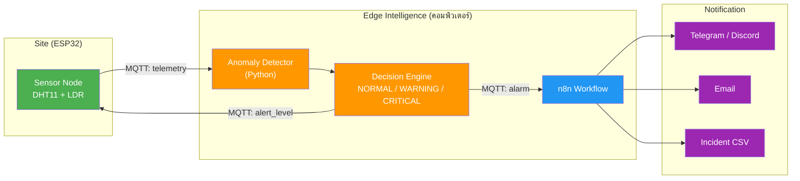
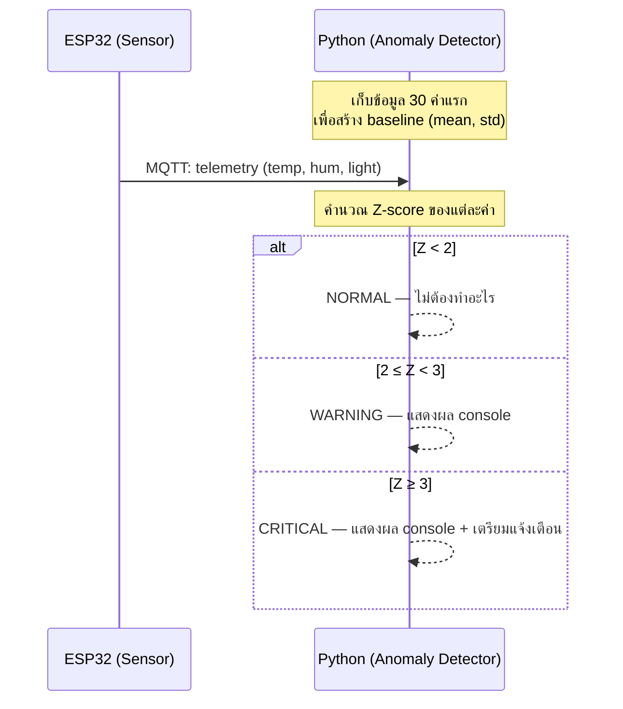
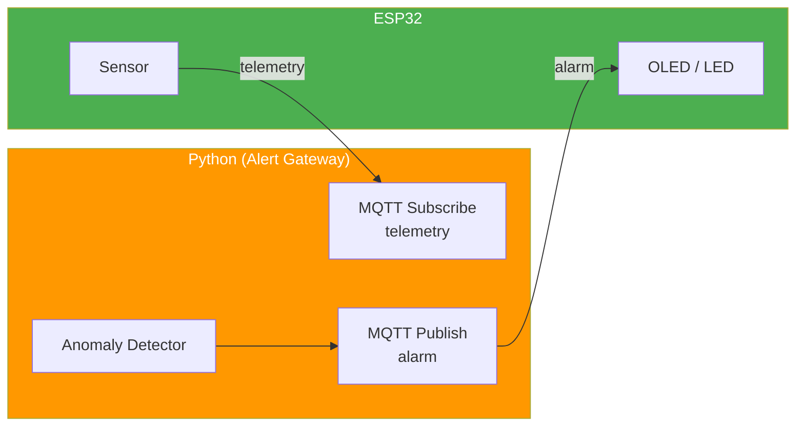
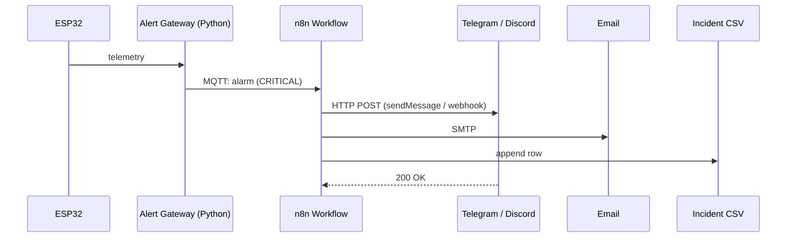

# ใบงานการทดลองที่ 7: Edge Intelligence — Anomaly Detection & Workflow Automation

---

## วัตถุประสงค์

- เข้าใจแนวคิด Edge Intelligence และเห็นความต่างจาก Cloud Intelligence
- เขียนโปรแกรม Python ตรวจจับค่าผิดปกติจากข้อมูล Telemetry ด้วย Z-score ได้
- สร้างระบบที่ตัดสินใจระดับความรุนแรงของ Alarm ได้เองโดยไม่ต้องมีคนเฝ้าจอ
- ใช้ n8n สร้าง Workflow แจ้งเตือนผ่าน Telegram/Discord และ Email พร้อมบันทึก Incident ได้

## อุปกรณ์ที่ใช้ในการทดลอง

| ลำดับ | อุปกรณ์ | จำนวน |
| --- | --- | --- |
| 1 | ESP32 (จาก Labs ก่อนหน้า) | 1 ชุด |
| 2 | คอมพิวเตอร์ที่ติดตั้ง Python 3, Node.js และ n8n | 1 เครื่อง |
| 3 | MQTT Broker (Public: `broker.hivemq.com`) | 1 ตัว |
| 4 | บัญชี Telegram หรือ Discord | 1 บัญชี |
| 5 | Email Account (Gmail) | 1 บัญชี |

> 💡 ทุกอย่างรันบนคอมพิวเตอร์นักศึกษา หรือจะ deploy ขึ้น Cloud Server เป็นทางเลือกก็ได้

## ซอฟต์แวร์ที่ต้องติดตั้ง

| ซอฟต์แวร์ | วิธีติดตั้ง | ใช้ใน |
| --- | --- | --- |
| **Python 3** (≥ 3.8) | ติดตั้งจาก [python.org](https://python.org) | 7.1, 7.2 |
| **paho-mqtt** | `pip install paho-mqtt` | 7.1, 7.2 |
| **Node.js** (LTS ≥ 18) | ติดตั้งจาก [nodejs.org](https://nodejs.org) | 7.3 |
| **n8n** | `npm install -g n8n` | 7.3 |

---

# หลักการ Edge Intelligence

## Edge Intelligence คืออะไร

ระบบ IoT ทั่วไปมักทำงานแบบ "เก็บข้อมูล → ส่งขึ้น Cloud → ประมวลผล → แสดงผล" — แต่การส่งทุกอย่างขึ้น Cloud มีปัญหา: หน่วงเวลา, กิน bandwidth, และถ้า Cloud ล่มก็ใช้ไม่ได้ทั้งระบบ

**Edge Intelligence** คือการย้าย "สมอง" มาประมวลผลใกล้แหล่งข้อมูล (Edge) — ให้ระบบรู้จักค่าปกติ ตรวจจับความผิดปกติ และแจ้งเตือนเอง โดยไม่ต้องรอ Cloud

| ประโยชน์ | คำอธิบาย |
| --- | --- |
| **ตรวจจับได้ทันที** | ประมวลผลแบบ Real-time — ไม่ต้องรอ Cloud ตอบกลับ |
| **ลดปริมาณข้อมูล** | ส่งเฉพาะค่าผิดปกติไป Cloud — ประหยัด bandwidth |
| **ตัดสินใจอัตโนมัติ** | ระบบแจ้งเตือนเองโดยไม่ต้องมีคนเฝ้าจอ 24 ชม. |

## Anomaly Detection ด้วย Z-score

วิธีที่ง่ายที่สุดในการตรวจจับค่าผิดปกติคือการถามว่า "ค่านี้ห่างจากค่าปกติแค่ไหน?"

**Z-score** คือคำตอบ — มันบอกว่าข้อมูลใหม่ "ห่างจากค่าเฉลี่ย" กี่เท่าของค่าเบี่ยงเบนมาตรฐาน

```
Z = (ค่าใหม่ - ค่าเฉลี่ย) / ค่าเบี่ยงเบนมาตรฐาน
```

| Z-score | ระดับ Alarm | ความหมาย |
| --- | --- | --- |
| `Z < 2` | NORMAL | ค่าอยู่ในช่วงปกติ |
| `2 ≤ Z < 3` | WARNING | ค่าเริ่มผิดปกติ — ต้องเฝ้าระวัง |
| `Z ≥ 3` | CRITICAL | ค่าผิดปกติรุนแรง — ต้องดำเนินการทันที |

> 💡 ลองคิดตาม: ถ้าอุณหภูมิเฉลี่ย 30°C (std = 2) — ค่า 35°C จะได้ Z = 2.5 → WARNING, ค่า 37°C จะได้ Z = 3.5 → CRITICAL
>
> ยิ่ง Z มาก = ยิ่งผิดปกติมาก = ยิ่งต้องรีบจัดการ

## สถาปัตยกรรม Edge Intelligence



---

# การทดลองที่ 7.1 Statistical Anomaly Detection

ในส่วนนี้เราจะเขียนโปรแกรม Python ที่ "เรียนรู้" ค่าปกติของเซ็นเซอร์จากข้อมูล 30 ค่าแรก แล้วคอยจับตาดูว่าค่าที่เข้ามาหลังจากนั้นผิดปกติหรือไม่

## แนวคิด



## สิ่งที่ต้องทำ

### ขั้นตอนการทดลอง

1. **รัน ESP32** — ใช้โค้ดเดิมที่ publish telemetry ไป `kmutnb/<รหัสนักศึกษา>/telemetry`
2. **ติดตั้ง paho-mqtt** — `pip install paho-mqtt`
3. **เขียนโปรแกรม** — `anomaly_detector.py` (โค้ดเต็มอยู่ใน `docs/src/lab-7/`)
4. **ทดสอบ** — สังเกตค่า Z-score และระดับ Alarm เมื่อข้อมูลปกติ vs ผิดปกติ

### บทบาทของแต่ละ Node

| Node | ชื่อ | บทบาท |
| --- | --- | --- |
| ESP32 | **Sensor** | publish telemetry ไป MQTT ทุก 3 วินาที |
| คอมพิวเตอร์ | **Anomaly Detector** | subscribe telemetry → สร้าง baseline → คำนวณ Z-score → แสดงผล |

### โค้ดต้นแบบ

โค้ดเต็มอยู่ใน `docs/src/lab-7/anomaly_detector.py` — นักศึกษาต้องเขียนโค้ดของตัวเอง โดยอ้างอิงแนวคิดต่อไปนี้

```python
# ตัวอย่างแนวคิด — คำนวณ Z-score
def z_score(value, mean, std):
    return (value - mean) / std

# ตัวอย่างแนวคิด — จำแนกระดับ Alarm
def classify(z):
    if z >= 3:
        return "CRITICAL"
    elif z >= 2:
        return "WARNING"
    else:
        return "NORMAL"
```

### ผลลัพธ์ที่ต้องได้

- โปรแกรมแสดงค่า telemetry พร้อม Z-score และระดับ Alarm ทุกครั้งที่รับข้อมูล
- เมื่อข้อมูลปกติ → ระดับ NORMAL
- เมื่อบัง LDR หรือเป่า DHT11 → ระดับเปลี่ยนเป็น WARNING หรือ CRITICAL
- Console แสดงผลคล้าย:

```
[12:00:01] temp=30.2 hum=62.0 light=2800 | Z=0.3 | NORMAL
[12:00:04] temp=30.1 hum=61.5 light=2750 | Z=0.2 | NORMAL
[12:00:07] temp=35.8 hum=60.0 light=120  | Z=2.8 | WARNING
[12:00:10] temp=38.5 hum=59.0 light=80   | Z=4.1 | CRITICAL
```

## บันทึกผลการทดลอง

ถ่ายภาพหน้าจอ Console — ต้องเห็นค่า Z-score และระดับ Alarm ทั้ง NORMAL, WARNING, CRITICAL

### คำถามท้าย 7.1

1. Z-score มีข้อจำกัดอะไรบ้าง — ยกตัวอย่างกรณีที่ Z-score ไม่สามารถตรวจจับความผิดปกติได้
2. ถ้าค่าเฉลี่ยและค่าเบี่ยงเบนมาตรฐานเปลี่ยนไปตามช่วงเวลา (เช่น กลางวันร้อน กลางคืนเย็น) ควรปรับปรุงวิธีอย่างไร

---

# การทดลองที่ 7.2 Intelligent Alert Gateway

ใน 7.1 เราแค่ "เห็น" ค่าผิดปกติบน console — แต่ในระบบจริง Alarm ที่ไม่มีการแจ้งเตือนก็เหมือนไม่มี Alarm

ในส่วนนี้เราจะต่อยอดให้ Python **ตัดสินใจเอง** ว่า Alarm ระดับไหน แล้ว publish กลับไป MQTT ให้ ESP32 แสดงผลบน OLED/LED — เหมือนระบบแจ้งเตือนในห้อง NOC จริง

## แนวคิด



## สิ่งที่ต้องทำ

### ขั้นตอนการทดลอง

1. **เขียนโปรแกรม** — `alert_gateway.py` (โค้ดเต็มอยู่ใน `docs/src/lab-7/`)
2. **อัปเดต ESP32** — เพิ่ม MQTT Subscribe topic `kmutnb/<รหัสนักศึกษา>/alarm` → แสดงผลระดับ Alarm บน OLED หรือ LED
3. **ทดสอบ** — สร้างเหตุการณ์ผิดปกติ (บัง LDR, เป่า DHT11) → สังเกต ESP32 แสดงระดับ Alarm

### บทบาทของแต่ละ Node

| Node | ชื่อ | บทบาท |
| --- | --- | --- |
| ESP32 | **Sensor + Display** | publish telemetry + subscribe alarm → แสดงผล OLED/LED |
| คอมพิวเตอร์ | **Alert Gateway** | รับ telemetry → ตรวจจับ anomaly → publish alarm |

### โค้ดต้นแบบ

```python
# ตัวอย่างแนวคิด — publish alarm กลับไป MQTT
alarm_payload = {
    "site_id": "A-01",
    "alarm_level": level,      # NORMAL / WARNING / CRITICAL
    "z_score": z,
    "sensor": "temperature",
    "value": temp,
    "timestamp": time.time()
}
client.publish(f"kmutnb/{STUDENT_ID}/alarm", json.dumps(alarm_payload))
```

### ผลลัพธ์ที่ต้องได้

- ESP32 แสดงระดับ Alarm บน OLED/LED ตามค่าที่ Python ตัดสินใจ
- เมื่อข้อมูลปกติ → OLED แสดง `NORMAL` + LED เขียว
- เมื่อค่าผิดปกติ → OLED แสดง `WARNING`/`CRITICAL` + LED เหลือง/แดง

## บันทึกผลการทดลอง

ถ่ายภาพ OLED/LED ของ ESP32 ขณะแสดงระดับ Alarm ทั้ง 3 ระดับ

### คำถามท้าย 7.2

1. การให้ Edge ตัดสินใจแทน Cloud มีข้อดีข้อเสียอย่างไร
2. ถ้า ESP32 หลุดจาก WiFi — Alarm ที่ Edge ตรวจพบจะส่งถึง ESP32 ได้หรือไม่ — ควรแก้ไขอย่างไร

---

# การทดลองที่ 7.3 Workflow Automation with n8n

ตอนนี้ระบบของเราตรวจจับ Alarm ได้แล้ว — แต่ยังขาดขั้นตอนสุดท้าย: **การแจ้งเตือนคนที่เกี่ยวข้อง**

ใน Lab นี้เราจะใช้ **n8n** — เครื่องมือ Workflow Automation ยอดนิยม — สร้างระบบที่เมื่อมี CRITICAL Alarm เข้ามา จะแจ้งเตือนผ่าน **Telegram หรือ Discord** (เลือกตามถนัด) + ส่ง Email + บันทึก Incident Ticket อัตโนมัติ

## เลือกช่องทางแจ้งเตือน

| ช่องทาง | วิธีสร้าง | ข้อดี | ข้อเสีย |
| --- | --- | --- | --- |
| **Telegram Bot** | `@BotFather` → `/newbot` → ได้ Token | ตั้งค่าง่าย, ส่งถึงตัวบุคคล | ต้องติดตั้ง Telegram |
| **Discord Webhook** | Server → Channel Settings → Integrations → Webhooks | ตั้งค่าง่าย, แชร์ให้ทีมดูได้ | ต้องมี Discord Server |

> 💡 เลือกช่องทางใดช่องทางหนึ่งตามความถนัด — หลักการทำงานเหมือนกันคือส่ง HTTP Request ไปยัง API ของแต่ละบริการ

## แนวคิด



## สิ่งที่ต้องทำ

### ขั้นตอนการทดลอง

1. **ติดตั้ง n8n** — `npm install -g n8n` แล้วรัน `n8n start` → เปิด `http://localhost:5678`
2. **สร้างช่องทางแจ้งเตือน** — เลือกอย่างใดอย่างหนึ่ง:

   **ตัวเลือก A: Telegram Bot**
   - เปิด Telegram → ค้นหา `@BotFather` → พิมพ์ `/newbot` → ตั้งชื่อ bot → ได้ **Token**
   - ส่งข้อความให้ bot ของตัวเองก่อน (เพื่อให้ bot รู้จัก chat) → เปิด `https://api.telegram.org/bot<TOKEN>/getUpdates` → จด `chat_id`

   **ตัวเลือก B: Discord Webhook**
   - เปิด Discord Server → คลิกขวาที่ Channel → **Edit Channel** → **Integrations** → **Webhooks** → **New Webhook**
   - คัดลอก **Webhook URL** (รูปแบบ `https://discord.com/api/webhooks/<id>/<token>`)

3. **สร้าง Workflow** — ตามตาราง Node ด้านล่าง
4. **ทดสอบครบวงจร** — สร้างเหตุการณ์ CRITICAL → ตรวจ Telegram/Discord, Email, CSV

### Node ใน Workflow

| Node | หน้าที่ | การตั้งค่า |
| --- | --- | --- |
| **MQTT Trigger** | รับ Alarm จาก MQTT | Broker: `broker.hivemq.com:1883`, Topic: `kmutnb/<รหัสนักศึกษา>/alarm` |
| **Switch** | กรองเฉพาะ CRITICAL | Condition: `{{ $json.alarm_level }}` equals `CRITICAL` |
| **HTTP Request** | ส่ง Telegram / Discord | ดูตารางด้านล่าง |
| **Email** | ส่งอีเมลแจ้งเตือน | SMTP: `smtp.gmail.com:587`, To: อีเมลนักศึกษา |
| **Spreadsheet File** | บันทึก Incident | ไฟล์ CSV: `incident_log.csv` |

### การตั้งค่า HTTP Request Node

**Telegram Bot:**

| การตั้งค่า | ค่า |
| --- | --- |
| Method | POST |
| URL | `https://api.telegram.org/bot<TOKEN>/sendMessage` |
| Body (JSON) | `{"chat_id": <CHAT_ID>, "text": "[CRITICAL] Site {{ $json.site_id }}: {{ $json.sensor }} = {{ $json.value }}"}` |

**Discord Webhook:**

| การตั้งค่า | ค่า |
| --- | --- |
| Method | POST |
| URL | `<WEBHOOK_URL>` |
| Body (JSON) | `{"content": "[CRITICAL] Site {{ $json.site_id }}: {{ $json.sensor }} = {{ $json.value }}"}` |

### ผลลัพธ์ที่ต้องได้

- เมื่อเกิด CRITICAL Alarm → ได้รับข้อความแจ้งเตือนทาง Telegram หรือ Discord ภายในไม่กี่วินาที
- ได้รับ Email แจ้งเตือน
- ไฟล์ `incident_log.csv` มีบันทึกเหตุการณ์ (timestamp, site_id, alarm_level, sensor, value)

## บันทึกผลการทดลอง

ถ่ายภาพ:
1. **n8n Workflow** — แสดง Node ทั้งหมด
2. **Telegram / Discord** — ข้อความแจ้งเตือนที่ได้รับ
3. **Email** — อีเมลแจ้งเตือน
4. **incident_log.csv** — ข้อมูลที่บันทึก

### คำถามท้าย 7.3

1. Workflow Automation มีความสำคัญอย่างไรในการจัดการ Alarm ของสถานีฐานโทรคมนาคม
2. เปรียบเทียบข้อดีข้อเสียของ Telegram Bot กับ Discord Webhook สำหรับการแจ้งเตือน Alarm — ช่องทางใดเหมาะกับ NOC Engineer มากกว่ากัน เพราะเหตุใด
3. ถ้า n8n หยุดทำงาน — Alarm จะหายไปหรือไม่ — มีวิธีสำรองอย่างไร

---

# สรุปผลการทดลอง

อธิบายผลการทดลอง พร้อมวิเคราะห์ความถูกต้องของผลลัพธ์ และอธิบายสาเหตุของข้อผิดพลาด (ถ้ามี)

---

# คำถามท้ายใบงาน

1. Edge Intelligence ต่างจาก Cloud Intelligence อย่างไร — จงเปรียบเทียบข้อดีข้อเสีย พร้อมยกตัวอย่างการใช้งานในระบบโทรคมนาคม
2. ถ้าต้องการให้ระบบตรวจจับความผิดปกติแบบหลายมิติ (เช่น อุณหภูมิ + ความชื้น + แสง พร้อมกัน) ควรใช้วิธีใดแทน Z-score แบบทีละค่า
3. จงออกแบบระบบ AIoT ที่ใช้ Edge Intelligence + Workflow Automation สำหรับตรวจสอบสถานีฐานโทรคมนาคม 10 แห่ง — อธิบายสถาปัตยกรรมและ MQTT Topic Design