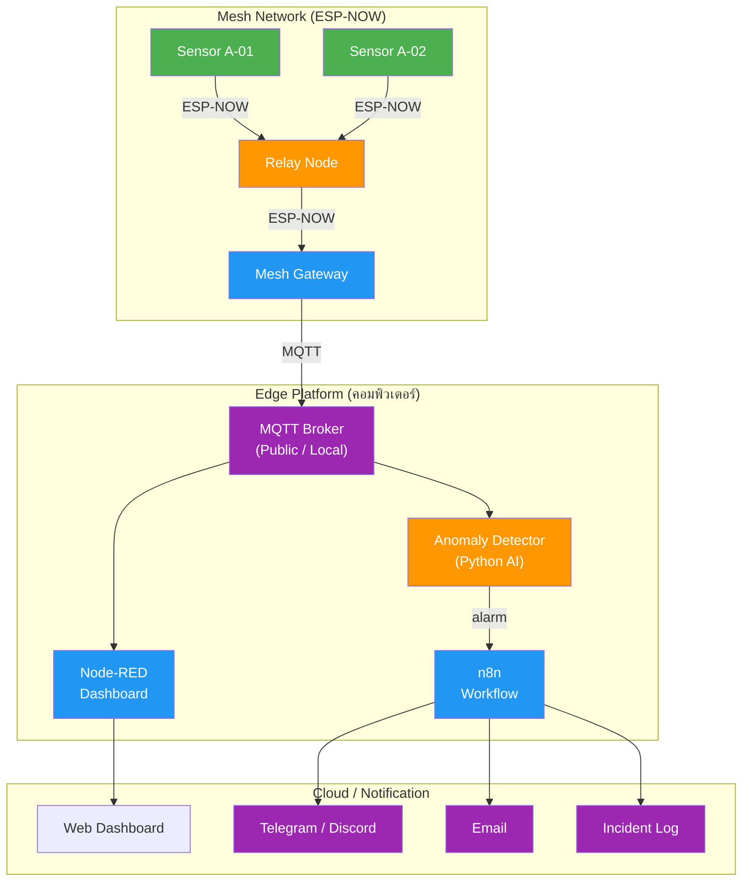

# ใบงานการทดลองที่ 8: AIoT Station — Full System Integration

---

## วัตถุประสงค์

- สามารถบูรณาการระบบทั้งหมดจาก Lab 1-7 เข้าด้วยกันเป็นระบบ AIoT สำหรับตรวจสอบสถานีฐานโทรคมนาคมได้
- สามารถทดสอบระบบแบบ End-to-End ได้
- สามารถนำเสนอระบบและอธิบายสถาปัตยกรรมโดยรวมได้

## อุปกรณ์ที่ใช้ในการทดลอง

| ลำดับ | อุปกรณ์ | จำนวน |
| --- | --- | --- |
| 1 | ESP32 (จาก Labs ก่อนหน้า) | 1-2 ชุด |
| 2 | คอมพิวเตอร์ (รัน Node-RED, n8n, Python AI) | 1 เครื่อง |
| 3 | เซ็นเซอร์ทั้งหมด (DHT11, LDR, PIR, Obstacle) | ตามที่ใช้ |
| 4 | OLED Display | 1 ตัว |
| 5 | Relay, Buzzer, LED | ตามที่ใช้ |

> 💡 ทุกบริการรันบนคอมพิวเตอร์นักศึกษา หรือจะ deploy ขึ้น Cloud Server เป็นทางเลือกก็ได้

---

# หลักการ AIoT Station

## จาก IoT ไปสู่ AIoT

| ความสามารถ | IoT (Lab 1-6) | AIoT (Lab 7-8) |
| --- | --- | --- |
| เก็บข้อมูล | ✅ | ✅ |
| ส่งข้อมูล | ✅ | ✅ |
| แสดงผล | ✅ | ✅ |
| ตรวจจับความผิดปกติ | ❌ | ✅ (Lab 7) |
| แจ้งเตือนอัตโนมัติ | ❌ | ✅ (Lab 7) |
| ตัดสินใจอัตโนมัติ | ❌ | ✅ (Lab 8) |

## สถาปัตยกรรมรวม AIoT Station



---

# การทดลองที่ 8.1 System Architecture & Setup

## ขั้นตอนการทดลอง

1. ตรวจสอบความพร้อมของระบบทั้งหมด

   | ระบบ | Lab | สถานะ |
   | ---- | --- | ------ |
   | Sensor Node (ESP32 + เซ็นเซอร์) | Lab 1 | |
   | MQTT Communication | Lab 2 | |
   | NOC Dashboard (Node-RED) | Lab 3 | |
   | Edge Gateway (Multi-Station) | Lab 4 | |
   | Mesh Network (ESP-NOW) | Lab 5 | |
   | Dynamic Mesh + MQTT Bridge | Lab 6 | |
   | Edge Intelligence (Anomaly Detection) | Lab 7 | |
   | Workflow Automation (n8n) | Lab 7 | |

2. รันบริการทั้งหมดบนคอมพิวเตอร์

   ```bash
   # 1. Node-RED Dashboard (จาก Lab 3/4)
   node-red

   # 2. n8n Workflow (จาก Lab 7.3)
   n8n start

   # 3. Anomaly Detector (จาก Lab 7.2)
   python3 alert_gateway.py
   ```

3. เปิด ESP32 — เชื่อมต่อ WiFi และ MQTT Broker (ใช้โค้ดจาก Lab 2/6)
4. ตรวจสอบว่าระบบทั้งหมดทำงานพร้อมกัน

## บันทึกผลการทดลอง

| บริการ | Port | Status | Log ตรวจสอบ |
| ------ | ---- | ------ | ------------ |
| Node-RED Dashboard | 1880 | | |
| n8n | 5678 | | |
| Anomaly Detector (Python) | - | | |
| ESP32 (MQTT) | - | | |

---

# การทดลองที่ 8.2 End-to-End Scenario Testing

## ขั้นตอนการทดลอง

1. ทดสอบ Scenario ปกติ (Normal Operation)

   | ขั้นตอน | สิ่งที่ควรเกิดขึ้น |
   | ------- | ---------------- |
   | ESP32 ส่ง Telemetry ทุก 5s | ข้อมูลปรากฏบน NOC Dashboard |
   | OLED แสดง SITE A-01 ปกติ | LED เขียวติด |
   | Heartbeat ทุก 30s | Status = Online |

2. ทดสอบ Scenario WARNING

   | ขั้นตอน | สิ่งที่ควรเกิดขึ้น |
   | ------- | ---------------- |
   | บัง LDR (แสงลดลงผิดปกติ) | Anomaly Detector ตรวจพบ → Z-score 2-3 |
   | Alarm Level = WARNING | Dashboard เปลี่ยนเป็นสีเหลือง |
   | OLED แสดง WARNING | LED เหลืองติด |

3. ทดสอบ Scenario CRITICAL + Automation

   | ขั้นตอน | สิ่งที่ควรเกิดขึ้น |
   | ------- | ---------------- |
   | เป่า DHT11 (อุณหภูมิพุ่ง) | Anomaly Detector ตรวจพบ → Z-score ≥ 3 |
   | Alarm Level = CRITICAL | Dashboard เปลี่ยนเป็นสีแดง |
   | n8n Workflow ทำงาน | Telegram/Discord + Email + Incident CSV |

4. ทดสอบ Scenario Mesh Fault Tolerance

   | ขั้นตอน | สิ่งที่ควรเกิดขึ้น |
   | ------- | ---------------- |
   | ปิด Relay A (จาก Lab 6.2) | Sensor สลับเส้นทางไป Relay B อัตโนมัติ |
   | เปิด Relay A กลับ | ระบบกลับสู่เส้นทางหลัก |
   | ตรวจสอบ MQTT | ข้อมูลยังไหลต่อเนื่อง ไม่ขาดตอน |

## บันทึกผลการทดลอง

| Scenario | ระบบที่เกี่ยวข้อง | ผลลัพธ์ | ผ่าน/ไม่ผ่าน |
| -------- | ---------------- | ------- | ----------- |
| Normal Operation | ESP32 → MQTT → Dashboard | | |
| WARNING | ESP32 → Python AI → Dashboard | | |
| CRITICAL + Auto | ESP32 → Python AI → n8n → Telegram/Discord/Email | | |
| Mesh Fault Tolerance | Sensor → Relay B → Mesh GW → MQTT | | |

---

# การทดลองที่ 8.3 การนำเสนอระบบ

## ขั้นตอนการทดลอง

1. เตรียมการนำเสนอระบบ AIoT Telecom Station ประกอบด้วย

   - สถาปัตยกรรมระบบโดยรวม (Overall System Architecture)
   - การทำงานของ Sensor Node
   - การสื่อสารผ่าน MQTT
   - NOC Dashboard แบบ Real-time
   - Edge Gateway และ Protocol Translation
   - Dynamic Mesh Network และ Self-Healing (จาก Lab 6)
   - Edge Intelligence และ Anomaly Detection (จาก Lab 7)
   - Workflow Automation และการแจ้งเตือน (จาก Lab 7)

2. สาธิตการทำงานของระบบแบบ End-to-End

   - แสดง Dashboard ขณะทำงานปกติ
   - สร้างเหตุการณ์จำลอง (จำลอง Cooling Failure)
   - แสดง Alarm ที่เกิดขึ้น
   - แสดงการสลับเส้นทาง Mesh เมื่อ Relay ล่ม (Self-Healing)
   - แสดงการแจ้งเตือนผ่าน Telegram/Discord/Email
   - แสดง Incident Ticket ที่ถูกสร้าง

3. อภิปรายและตอบคำถาม

### คำถามท้ายการทดลอง

1. จากการทดลองทั้ง 8 Lab จงอธิบายความสัมพันธ์ระหว่างระบบต่าง ๆ ใน Telecom Base Station Remote Monitoring System
2. ถ้าต้องการนำระบบนี้ไปใช้งานจริง ควรพัฒนาเพิ่มเติมในส่วนใดบ้าง
3. จงยกตัวอย่างกรณีใช้งานจริง (Use Case) ที่ระบบนี้สามารถประยุกต์ใช้ได้

---

# สรุปผลการทดลอง

อธิบายผลการทดลอง พร้อมวิเคราะห์ความถูกต้องของผลลัพธ์ และอธิบายสาเหตุของข้อผิดพลาด (ถ้ามี)

---

# คำถามท้ายใบงาน

1. จงเขียนรายงานสรุปโครงการ (Project Report) ความยาว 3-5 หน้า ครอบคลุม
   - ความเป็นมาและวัตถุประสงค์
   - สถาปัตยกรรมระบบ
   - การทดลองแต่ละ Lab (สรุป)
   - ปัญหาและแนวทางแก้ไข
   - ข้อเสนอแนะในการพัฒนาเพิ่มเติม

2. ระบบ AIoT Telecom Station ที่พัฒนาขึ้นสามารถช่วยเพิ่ม Availability และ Uptime ของสถานีฐานได้อย่างไร

3. จงเปรียบเทียบระบบที่พัฒนากับระบบ Remote Monitoring ในอุตสาหกรรมโทรคมนาคมจริง (เช่น Ericsson NMS, Huawei U2000) — จุดเด่นและจุดที่ยังต้องพัฒนา

4. ถ้าต้องการปรับระบบให้รองรับหลายร้อย Site (Scalability) ควรปรับปรุงสถาปัตยกรรมส่วนใดบ้าง