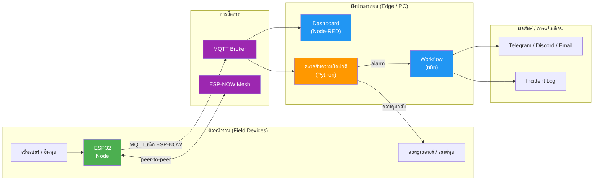

# ใบงานการทดลองที่ 8: Mini Project — การออกแบบและพัฒนาระบบ IoT/AIoT

---

## วัตถุประสงค์

- สามารถเลือกโจทย์ปัญหาจริงและออกแบบระบบ IoT/AIoT เพื่อแก้ปัญหานั้นได้อย่างเป็นระบบ
- สามารถบูรณาการความรู้จาก Lab 1-7 (ESP32, MQTT, Node-RED, ESP-NOW Mesh, Anomaly Detection, n8n) มาใช้ในโปรเจกต์ของตนเองได้
- สามารถทำงานร่วมกับผู้อื่นเป็นทีม ตั้งแต่การออกแบบ พัฒนา ทดสอบ จนถึงการนำเสนอผลงานได้

## อุปกรณ์ที่ใช้ในการทดลอง

อุปกรณ์ขึ้นอยู่กับการออกแบบของแต่ละกลุ่ม — ตารางนี้เป็นเพียงแนวทาง ให้เติมตามที่กลุ่มใช้จริง

| ลำดับ | อุปกรณ์ | จำนวน |
| --- | --- | --- |
| 1 | ESP32 (จาก Labs ก่อนหน้า) | 1-3 ชุด |
| 2 | คอมพิวเตอร์ (รัน Node-RED, n8n, Python ตามที่ออกแบบ) | 1 เครื่อง |
| 3 | เซ็นเซอร์ (DHT11, LDR, PIR, Obstacle, ฯลฯ) | ตามที่ออกแบบ |
| 4 | OLED Display, LED, Buzzer, Relay | ตามที่ออกแบบ |
| 5 | อุปกรณ์เสริมอื่น ๆ (ตามโจทย์ของกลุ่ม) | ตามที่ออกแบบ |

> 💡 ทุกบริการรันบนคอมพิวเตอร์นักศึกษา หรือจะ deploy ขึ้น Cloud Server เป็นทางเลือกก็ได้

---

# หลักการ / แนวคิด

## Project-Based Learning

ใน Labs ที่ 1-7 นักศึกษาได้เรียนรู้องค์ประกอบของระบบ IoT ทีละส่วน — ตั้งแต่การอ่านค่าเซ็นเซอร์ การสื่อสารข้อมูล การสร้าง Dashboard ไปจนถึง Mesh Network และ Workflow Automation ใน Mini Project นี้ นักศึกษาจะต้องนำทั้งหมดมา **ประกอบเป็นระบบที่สมบูรณ์ของตนเอง** โดยเริ่มจากการตั้งโจทย์เอง

| ขั้นตอน | สิ่งที่ต้องทำ |
| --- | --- |
| 1. เลือกโจทย์ | หาปัญหาจริงที่น่าสนใจ แล้วนิยามขอบเขตของระบบให้ชัดเจน |
| 2. ออกแบบ | วาดสถาปัตยกรรมระบบ เลือกเซ็นเซอร์/แอคชูเอเตอร์ เลือกโปรโตคอลสื่อสาร เลือก Platform แสดงผล |
| 3. พัฒนา | เขียนโค้ด ESP32, Python, Node-RED, n8n ตามที่ออกแบบ |
| 4. ทดสอบ | ทดสอบแต่ละส่วน → ทดสอบภาพรวมแบบ End-to-End |
| 5. นำเสนอ | สาธิตระบบจริง พร้อมส่งรายงานโครงการ |

## สถาปัตยกรรมแบบ Generic

ไม่ว่าโจทย์จะเป็นแบบใด ระบบ IoT ส่วนใหญ่มักมีโครงสร้างตามรูปแบบนี้ — กลุ่มควรทำความเข้าใจโครงสร้างนี้แล้วปรับใช้ให้เหมาะกับโจทย์ของตนเอง

---

# ข้อกำหนดของโปรเจกต์

## การจัดกลุ่ม

| หัวข้อ | รายละเอียด |
| --- | --- |
| ขนาดกลุ่ม | 2-3 คนต่อกลุ่ม |
| โจทย์ | เลือกเองอย่างอิสระ (กลุ่มต่างกันต้องมีโจทย์ต่างกัน — จดทะเบียนโจทย์กับผู้สอนก่อนเริ่มพัฒนา) |
| ภาษาที่ใช้เขียนโค้ด | อิสระ — Arduino/C++ บน ESP32, Python, JavaScript (Node-RED / n8n) |

## ความต้องการขั้นต่ำ (Minimum Requirements)

| ส่วนประกอบ | ข้อกำหนด |
| --- | --- |
| **อินพุต** | ESP32 อ่านค่าอย่างน้อย 2 เซ็นเซอร์ หรือ 1 เซ็นเซอร์ + 1 อินพุตอื่น (ปุ่มกด, คำสั่งจาก Dashboard) |
| **การสื่อสาร** | อย่างน้อย 1 ช่องทางไร้สาย — MQTT ผ่าน WiFi หรือ ESP-NOW |
| **เอาต์พุต** | อย่างน้อย 1 อย่างจาก: OLED Display, LED, Buzzer, Relay, Node-RED Dashboard |
| **ระบบตัดสินใจ** | มีเงื่อนไขควบคุมอัตโนมัติอย่างน้อย 1 ข้อ (เช่น ค่าเกินกำหนด → เปิด Relay / ส่ง Alert) — ระบบต้องทำงานเองได้โดยไม่ต้องมีคนสั่งทุกครั้ง |
| **Multi-node (ถ้ากลุ่ม 3 คน)** | มี ESP32 มากกว่า 1 ตัวที่มีบทบาทต่างกันชัดเจน (เช่น Sensor Node + Relay/Gateway Node) |

## ตัวอย่างแนวคิดโจทย์

ตารางนี้เป็นเพียงตัวอย่างเพื่อช่วยระดมความคิด — กลุ่มสามารถเลือกโจทย์อื่นนอกเหนือจากนี้ได้อย่างอิสระ

| แนวคิด | คำอธิบายสั้น ๆ | เทคโนโลยีที่น่าใช้ |
| --- | --- | --- |
| **Smart Farm** | เฝ้าระวังอุณหภูมิ/ความชื้น รดน้ำอัตโนมัติเมื่อดินแห้ง แจ้งเตือนค่าผิดปกติ | MQTT, Node-RED, Relay, Anomaly Detection |
| **Smart Parking** | ตรวจจับช่องจอดว่าง/เต็ม แสดงผล Dashboard แจ้งเตือนเมื่อเต็ม | ESP-NOW, Node-RED, Obstacle Sensor |
| **Air Quality Monitor** | เฝ้าระวังคุณภาพอากาศหลายจุด เตือนเมื่อฝุ่น/แก๊สเกินมาตรฐาน | MQTT Mesh, Anomaly Detection, n8n |
| **Smart Home Security** | ตรวจจับการเคลื่อนไหวผิดปกติ เปิด Buzzer แจ้งเตือนเจ้าของ | PIR, MQTT, n8n, Buzzer |
| **Server Room Monitor** | เฝ้าระวังอุณหภูมิห้องเครื่อง แจ้งเตือน CRITICAL ผ่าน Telegram/Email | Anomaly Detection, n8n, Node-RED |
| **Connected Classrooms** | ควบคุมไฟ/แอร์ตามจำนวนคนในห้อง สรุปการใช้พลังงานรายวัน | PIR, LDR, MQTT, Node-RED |

---

# สิ่งที่ต้องส่งมอบ

## 1. Working Demo — สาธิตระบบจริง

นำเสนอระบบที่ทำงานจริงหน้าชั้นเรียน (Live Demo) ในส่วนของ:

| รายการ | สิ่งที่ต้องแสดงให้เห็น |
| --- | --- |
| สถาปัตยกรรมระบบ | อธิบายภาพรวม — อุปกรณ์แต่ละตัวทำหน้าที่อะไร สื่อสารกันอย่างไร |
| การทำงานปกติ | ระบบทำงานครบวงจร — อ่านเซ็นเซอร์ → สื่อสาร → แสดงผล/ควบคุม |
| เงื่อนไขอัตโนมัติ | กระตุ้นเหตุการณ์จริง (แตะเซ็นเซอร์ / เปลี่ยนค่า) → ระบบตอบสนองอัตโนมัติตามที่ออกแบบ |
| การจัดการปัญหา | สาธิตว่าเมื่อส่วนหนึ่งขัดข้อง ระบบรับมืออย่างไร (ถ้ามีการออกแบบไว้) |

## 2. Project Report — รายงานโครงการ

รายงานความยาว 5-8 หน้า ครอบคลุมหัวข้อต่อไปนี้

| หัวข้อในรายงาน | สิ่งที่ต้องมี |
| --- | --- |
| โจทย์และวัตถุประสงค์ | ปัญหาที่เลือก ทำไมจึงน่าสนใจ ขอบเขตของระบบ |
| สถาปัตยกรรมระบบ | แผนภาพ (Mermaid / วาดเอง) ตารางบทบาทของแต่ละ Node และ topic/protocol ที่ใช้ |
| การออกแบบรายละเอียด | การเลือกเซ็นเซอร์/แอคชูเอเตอร์ เงื่อนไขการตัดสินใจ โครงสร้างข้อมูล (JSON payload) |
| ผลการทดสอบ | ผลทดสอบแบบ End-to-End พร้อมภาพถ่าย/screenshot ประกอบ |
| ปัญหาและการแก้ไข | ปัญหาที่พบระหว่างพัฒนา และวิธีแก้ไข |
| การแบ่งหน้าที่ | ใครทำส่วนไหน และขอบเขตความรับผิดชอบของสมาชิกแต่ละคน |
| แนวทางพัฒนาต่อ | ถ้าทำจริงในเชิงพาณิชย์ ควรพัฒนาส่วนใดเพิ่ม |

> ⚠️ ห้ามคัดลอกระบบจากกลุ่มอื่นหรือจากแหล่งข้อมูลภายนอกโดยไม่อ้างอิง — ทุกกลุ่มมีโจทย์ต่างกัน ระบบจึงต้องออกแบบและพัฒนาเอง
